# Препараты, снижающие кислотность желудочного сока

## 1. Ингибиторы протонной помпы (ИПП)

### Общая схема механизма действия

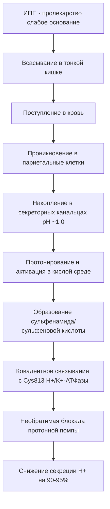

### Основные представители

__Омепразол__ (первый ИПП, 1988)

- __Показания:__ ГЭРБ, язвенная болезнь желудка и ДПК, эрадикация H. pylori (в комбинации), синдром Золлингера-Эллисона
- __Противопоказания:__ Гиперчувствительность, одновременный прием с рилпивирином, беременность (категория C)

__Эзомепразол__ (S-изомер омепразола)

- __Показания:__ Аналогичны омепразолу, эрозивный эзофагит
- __Биодоступность:__ 89% (выше, чем у омепразола)

__Пантопразол__

- __Показания:__ ГЭРБ, язвенная болезнь, синдром Золлингера-Эллисона
- __Биодоступность:__ 77%
- __Особенности:__ Меньше взаимодействий с CYP450

__Рабепразол__

- __Показания:__ ГЭРБ, язвенная болезнь, эрадикация H. pylori
- __Особенности:__ Быстрое начало действия

__Лансопразол__

- __Показания:__ Язвенная болезнь, ГЭРБ, эрадикация H. pylori
- __Биодоступность:__ 80-90%

### Детальный механизм действия ИПП

__Фармакокинетика:__

- ИПП являются слабыми основаниями с pKa₁ 3.8-4.9
- Селективное накопление в секреторных канальцах париетальных клеток (концентрация в 1000 раз выше, чем в крови)
- Кислотозависимая активация: двойное протонирование необходимо для превращения в активную форму

__Молекулярный механизм:__

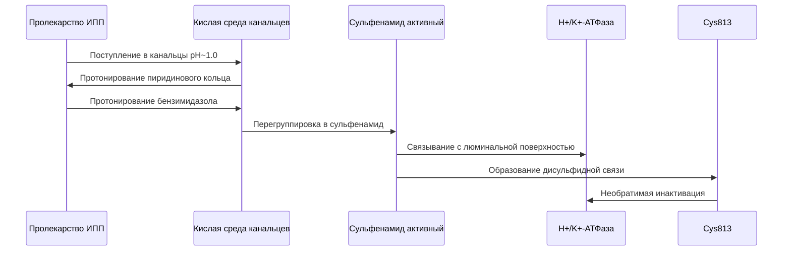

__Фармакодинамика:__

- Период полувыведения: ~1-2 часа
- Продолжительность действия: 24-48 часов (из-за необратимого связывания)
- Восстановление секреции: требуется синтез новых протонных помп (~24-48 часов)
- Максимальный эффект: после 3-5 дней регулярного приема

### Подробные побочные эффекты и перекрестные реакции

__Частые побочные эффекты (>1%):__

- Головная боль (5-7%)
- Тошнота и диарея (3-5%)
- Абдоминальная боль (2-4%)
- Запор (2-3%)
- Метеоризм (1-3%)
- Головокружение (1-2%)

__Побочные эффекты при длительном применении:__

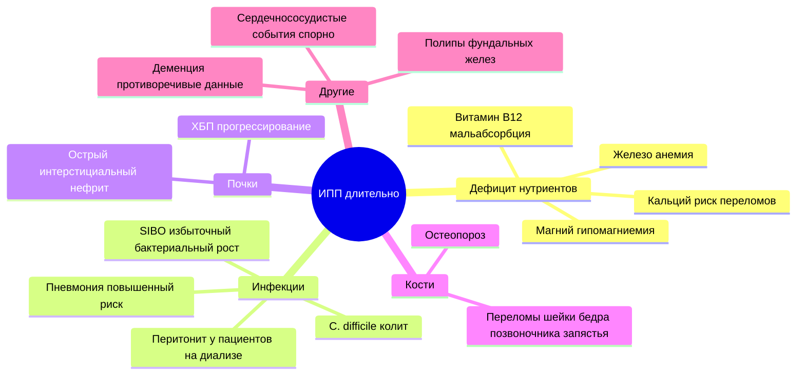

__Серьезные редкие побочные эффекты:__

- Острый интерстициальный нефрит (<0.1%)
- Кожная красная волчанка (обратимая)
- Синдром Стивенса-Джонсона, токсический эпидермальный некролиз (крайне редко)
- DRESS-синдром (Drug Reaction with Eosinophilia and Systemic Symptoms)
- Острый генерализованный экзантематозный пустулез (AGEP)
- Гипомагниемия тяжелая (<0.5%, но клинически значимая)
- Рабдомиолиз (крайне редко, связан с миопатией)

__Лекарственные взаимодействия через CYP2C19:__

Омепразол и эзомепразол (наиболее выраженное ингибирование):

- __Клопидогрел:__ Снижение антиагрегантного эффекта (конкурентное ингибирование CYP2C19) - клинически значимо, избегать комбинации
- __Варфарин:__ Увеличение INR, риск кровотечений
- __Диазепам:__ Замедление метаболизма, усиление седации
- __Фенитоин:__ Повышение концентрации, риск токсичности
- __Такролимус:__ Повышение уровня иммуносупрессанта

Пантопразол (минимальное ингибирование CYP450):

- Меньше взаимодействий, предпочтителен при полипрагмазии

__Взаимодействия, не связанные с CYP450:__

- __Метотрексат:__ ИПП уменьшают почечную элиминацию, риск токсичности
- __Дигоксин:__ Повышение абсорбции дигоксина
- __Кетоконазол, итраконазол, атазанавир:__ Снижение абсорбции из-за повышения pH желудка

__Фармакогенетика:__

- Полиморфизм CYP2C19:
  - Медленные метаболизаторы (PM): AUC в 7.5 раз выше для омепразола
  - Быстрые метаболизаторы (EM): стандартные дозы
  - Промежуточные метаболизаторы (IM): умеренное повышение концентрации

### Перекрестные реакции

- Перекрестная гиперчувствительность между разными ИПП возможна (~50% случаев)
- При аллергии на один ИПП можно попробовать структурно отличающийся (например, пантопразол вместо омепразола)

---

## 2. Блокаторы H₂-гистаминовых рецепторов

### Механизм действия

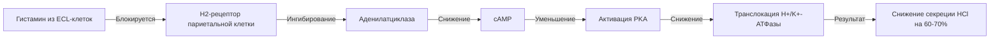

### Основные представители

__Фамотидин__

- __Показания:__ Язвенная болезнь, ГЭРБ, профилактика стресс-язв
- __Дозировка:__ 20-40 мг 1-2 раза/день
- __Противопоказания:__ Гиперчувствительность

__Циметидин__ (исторический препарат, первый H₂-блокатор, 1977)

- __Показания:__ Язвенная болезнь (сейчас редко используется)
- __Особенности:__ Сильный ингибитор CYP450 (множественные взаимодействия)
- __Эндокринные эффекты:__ Антиандрогенное действие → гинекомастия (0.1-2%), снижение либидо, импотенция

__Низатидин__

- __Показания:__ Язвенная болезнь, ГЭРБ
- __Дозировка:__ 150-300 мг/день

__Ранитидин__ (ИЗЪЯТ С РЫНКА в 2020)

- Причина: контаминация N-нитрозодиметиламином (NDMA) - потенциальным канцерогеном
- Исторически: наиболее популярный H₂-блокатор (1981-2020)

### Детальный механизм действия

__На молекулярном уровне:__

- H₂-блокаторы являются конкурентными антагонистами гистамина
- Связываются с H₂-рецепторами на базолатеральной мембране париетальных клеток
- Блокируют гистамин-индуцированное повышение cAMP
- Подавляют как базальную, так и стимулированную секрецию (особенно ночную)

__Фармакокинетика:__

- Биодоступность: 40-60%
- Период полувыведения:
  - Циметидин: 2 часа
  - Ранитидин: 2-3 часа
  - Фамотидин: 2.5-3.5 часа
  - Низатидин: 1-2 часа
- Элиминация: почечная (циметидин, ранитидин), ренальная + печеночная (фамотидин, низатидин)

### Побочные эффекты

__Общие для класса (редкие, <1%):__

- Головная боль
- Головокружение
- Усталость, сонливость
- Диарея или запор
- Тошнота
- Сыпь

__Циметидин-специфичные:__

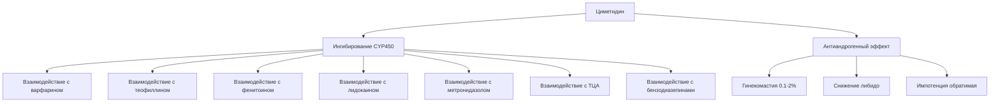

__Серьезные побочные эффекты (все H₂-блокаторы):__

- Тромбоцитопения (<0.1%)
- Агранулоцитоз (крайне редко)
- Панцитопения (крайне редко)
- Брадикардия (при в/в введении, особенно быстром)
- Спутанность сознания, галлюцинации (особенно у пожилых, при почечной недостаточности)
- Гепатотоксичность (редко):
  - Повышение трансаминаз
  - Холестатический гепатит
  - Желтуха (обратимая при отмене)

__Связанные с длительным применением:__

- Дефицит витамина B₁₂ (снижение кислотности → нарушение абсорбции)
- Повышенный риск пневмонии (мета-анализ 2022: OR 1.3)
- Повышенный риск C. difficile инфекции
- Перитонит (редко)
- Некротизирующий энтероколит у новорожденных
- Рак печени (циметидин, ранитидин - спорно)
- Рак желудка (длительное применение - спорно)
- Переломы бедра (повышенный риск)

### Лекарственные взаимодействия

__Циметидин (мощный ингибитор CYP1A2, 2C9, 2C19, 2D6, 2E1, 3A4):__

- Варфарин → повышение INR
- Теофиллин → токсичность
- Фенитоин → повышение концентрации
- Лидокаин → токсичность
- Метопролол, пропранолол → усиление эффекта
- Метронидазол → повышение токсичности
- Амитриптилин, имипрамин → повышение концентрации
- Диазепам, мидазолам → усиление седации
- Метадон → повышение концентрации
- MDMA (экстази) → усиление эффектов

__Фамотидин и низатидин:__

- Минимальные взаимодействия с CYP450
- Предпочтительны при полипрагмазии

__Ранитидин (умеренный ингибитор CYP450):__

- Варфарин → умеренное повышение INR
- Теофиллин → умеренное повышение концентрации

__Снижение абсорбции других препаратов (все H₂-блокаторы):__

- Кетоконазол, итраконазол (требуют кислой среды)
- Карбонат кальция
- Железо
- Атазанавир

### Тахифилаксия

- Хорошо документирована для H₂-блокаторов
- Развивается при в/в и пероральном применении
- Механизм: повышение уровня гастрина → стимуляция париетальных клеток
- Клиническое значение: снижение эффективности при длительном применении
---

# Препараты, повышающие кислотность

## Препараты соляной кислоты и пепсина

__Разведенная соляная кислота (Acidum hydrochloricum dilutum)__

- __Показания:__ Ахлоргидрия, гипоацидный гастрит
- __Механизм:__ Прямое восполнение дефицита HCl
- __Дозировка:__ 10-15 капель на ½ стакана воды во время еды
- __Побочные эффекты:__ Эрозии эмали зубов (пить через трубочку), изжога при передозировке

__Ацидин-пепсин__

- __Состав:__ Бетаина гидрохлорид + пепсин
- __Показания:__ Гипацидные состояния, атрофический гастрит
- __Механизм:__
  - Бетаина HCl → высвобождение HCl в желудке
  - Пепсин → протеолиз белков
- __Дозировка:__ 0.5-1 г растворить в ½ стакана воды, принимать во время еды
- __Побочные эффекты:__ Изжога, диспепсия

---

# Ферментные препараты

## Панкреатические ферменты

### Механизм действия

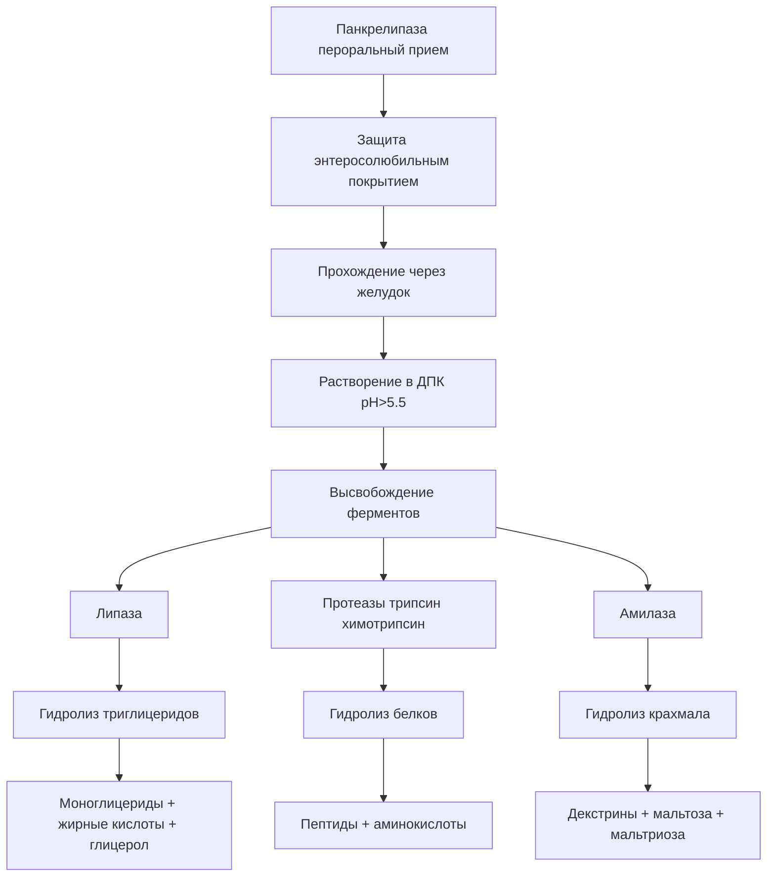

### Основные представители

__Панкреатин__

- __Состав:__ Липаза, протеазы, амилаза из поджелудочной железы свиней
- __Стандартизация USP:__
  - 1× панкреатин: 25 USP ед. амилазы, 2 USP ед. липазы, 25 USP ед. протеаз на 1 мг
  - 10× панкреатин: в 10 раз выше концентрация

__Панкрелипаза__ (более высокая активность липазы)

- Торговые названия: Creon, Pancreaze, Zenpep, Pertzye, Ultresa
- __Показания:__
  - Экзокринная панкреатическая недостаточность (ЭПН):
    - Муковисцидоз
    - Хронический панкреатит
    - Рак поджелудочной железы
    - Панкреатэктомия
    - Синдром Швахмана-Даймонда
  - Целиакия (вспомогательно)
  - Болезнь Крона (с мальабсорбцией)

__Противопоказания:__

- Острый панкреатит
- Обострение хронического панкреатита
- Гиперчувствительность к свиному белку
- Фиброзирующая колонопатия в анамнезе

### Детальная фармакокинетика

__Всасывание:__

- Панкреатические ферменты НЕ всасываются
- Действуют локально в просвете ЖКТ
- Энтеросолюбильное покрытие защищает от инактивации в желудке
- Оптимальное высвобождение при pH >5.5 в ДПК

__Формы выпуска:__

- __Энтеросолюбильные микросферы/минимикросферы__ (размер <2 мм для лучшей дисперсии с пищей)
- __Таблетки без покрытия__ (Viokace) - требуют сопутствующего приема ИПП

__Дозирование:__

- Основано на содержании липазы (наиболее важный фермент)
- Дети <12 месяцев: начать с 2000-4000 липазных ед. на 120 мл молока
- Дети >12 месяцев и взрослые:
  - Начальная доза: 500 липазных ед/кг/прием пищи
  - Максимум: 2500 липазных ед/кг/прием или 10000 липазных ед/кг/день
  - Или <4000 липазных ед/г жира в диете

__Мониторинг:__

- Коэффициент абсорбции жира (CFA) - золотой стандарт эффективности
- Частота стула, консистенция
- Вес тела, рост (у детей)
- Признаки дефицита жирорастворимых витаминов (A, D, E, K)
- Уровень глюкозы (при нарушении эндокринной функции поджелудочной)

### Подробные побочные эффекты

__Частые ЖКТ-эффекты (10-20%):__

- Абдоминальная боль
- Вздутие живота
- Диарея
- Тошнота
- Метеоризм
- Запор

__Дерматологические (2-5%):__

- Зуд
- Крапивница
- Сыпь

__Серьезные осложнения:__

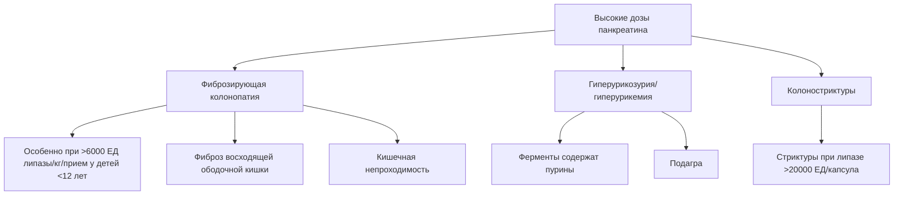

__Редкие серьезные побочные эффекты:__

- __Фиброзирующая колонопатия__ (<0.1%, в основном у детей с муковисцидозом):
  - Проявления: боль в животе, вздутие, диарея с кровью
  - Диагностика: колоноскопия с биопсией
  - Лечение: отмена препарата, иногда хирургическое
- __Гиперчувствительность:__
  - Анафилаксия (крайне редко)
  - Астма
  - Крапивница
- __Оральная мукозная раздражение:__
  - При разжевывании капсул (нельзя!)
  - Стоматит
- __Дистальная кишечная обструкция__ (DIOS - у пациентов с муковисцидозом)
- __Теоретический риск вирусной трансмиссии__ (свиные ферменты):
  - Риск минимизирован современными методами очистки
  - Случаев не зарегистрировано

__Эндокринные:__

- Дисгликемия (редко)

__Гематологические:__

- Нейтропения (казуистика, описан случай с панкрелипазой)

### Лекарственные взаимодействия

__Снижение эффективности панкреатических ферментов:__

- __Антациды (карбонат кальция, гидроксид алюминия):__
  - Повышают pH желудка → преждевременное растворение энтеросолюбильного покрытия
  - Инактивация ферментов в желудке
  - Рекомендация: разделить прием на 2-4 часа

__Усиление эффективности:__

- __ИПП (омепразол, пантопразол):__
  - Повышают дуоденальный pH → лучшее растворение энтеросолюбильного покрытия
  - Улучшают активность ферментов
  - Показаны при Viokace (неэнтеросолюбильная форма)

__Снижение абсорбции:__

- __Фолиевая кислота:__ высокие дозы панкреатина могут ингибировать абсорбцию
- __Железо:__ может быть нарушена абсорбция

__Влияние на другие препараты:__

- __Акарбоза:__ теоретически панкреатические ферменты могут снижать эффект акарбозы

### Особые популяции

__Беременность:__

- Категория C (FDA)
- Минимальное системное всасывание
- Безопасность для плода не доказана, но вреда не выявлено
- Использовать при явной необходимости (например, муковисцидоз)

__Грудное вскармливание:__

- Маловероятно попадание в грудное молоко (не всасываются)
- Можно использовать при необходимости

__Педиатрия:__

- Безопасны при правильном дозировании
- КРИТИЧНО: не превышать 2500 липазных ед/кг/прием у детей <12 лет (риск фиброзирующей колонопатии)

---

# Слабительные средства

## Классификация и механизмы действия

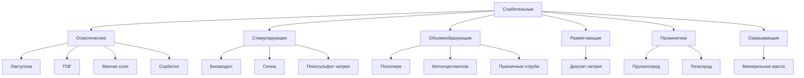

## 1. Осмотические слабительные

### Лактулоза

__Механизм действия:__

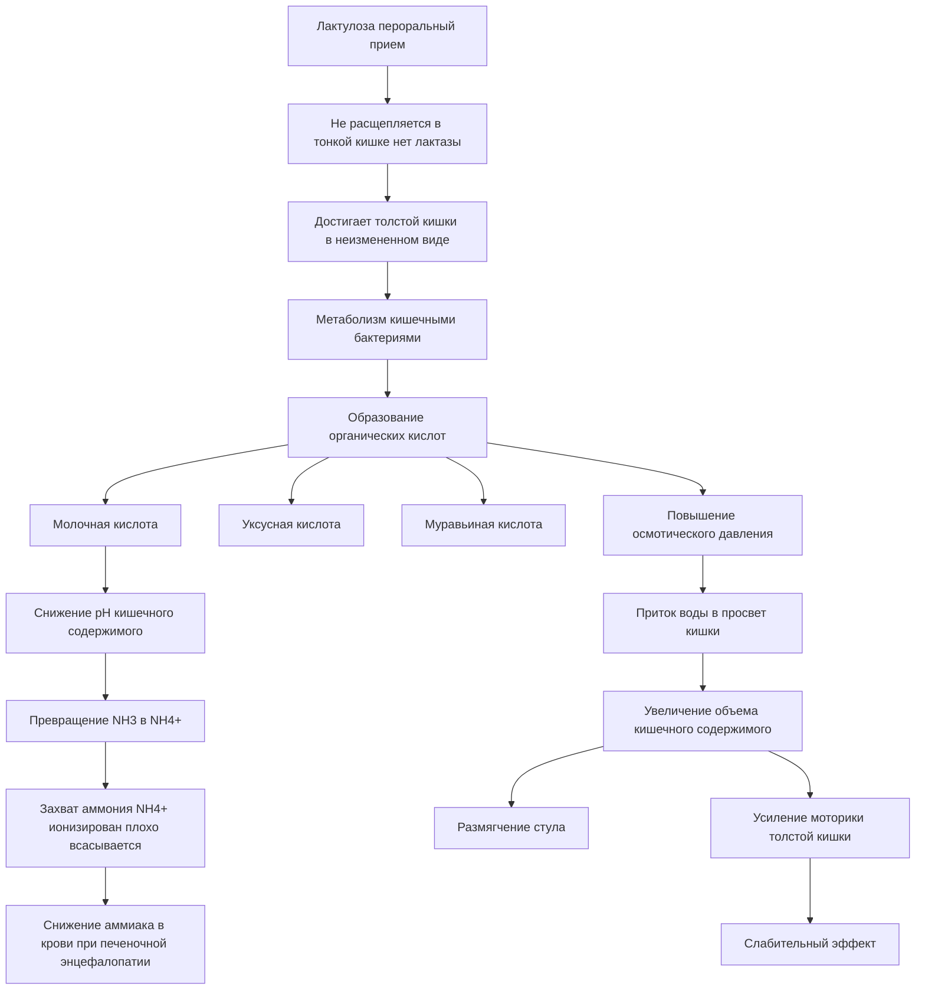

__Показания:__

- Хронический запор
- __Печеночная энцефалопатия__ (основное показание):
  - Снижение продукции аммиака
  - Снижение абсорбции аммиака
  - pH-опосредованная конверсия NH₃→NH₄⁺

__Противопоказания:__

- Галактоземия
- Непроходимость кишечника
- Подозрение на аппендицит
- Острый живот неясной этиологии

__Дозировка:__

- Запор: 15-30 мл 1-2 раза/день
- Печеночная энцефалопатия: 30-45 мл 3-4 раза/день (титровать до 2-3 мягких стулов/день)

__Фармакокинетика:__

- Всасывание: минимальное (<3%)
- Метаболизм: полностью в толстой кишке (бактериальный)
- Начало действия: 24-48 часов

__Побочные эффекты:__

__Частые (>10%):__

- Метеоризм, вздутие (50-70% в первые недели)
- Абдоминальные спазмы (30-40%)
- Тошнота (10-20%)
- Диарея при высоких дозах

__Редкие:__

- Электролитные нарушения (при длительном применении высоких доз):
  - Гипокалиемия
  - Гипернатриемия
  - Гипомагниемия
- Гипергликемия (у диабетиков - содержит галактозу и лактозу)

__Лекарственные взаимодействия:__

- __Антибиотики широкого спектра (неомицин):__ снижение эффективности лактулозы (уничтожение кишечной флоры)
- __Другие слабительные:__ аддитивный эффект

---

### Полиэтиленгликоль (ПЭГ, макрогол)

__Механизм:__

- Высокомолекулярный полимер (MW 3350-4000)
- Не всасывается, не метаболизируется
- Осмотически удерживает воду в просвете кишки
- Изоосмотичный раствор (с электролитами) - не вызывает электролитных нарушений

__Показания:__

- Хронический идиопатический запор (первая линия)
- Подготовка к колоноскопии (высокообъемные растворы)

__Дозировка:__

- Запор: 17 г (1 пакетик) в 240 мл воды 1 раз/день
- Подготовка к колоноскопии: 4 л раствора за 4-6 часов до процедуры

__Побочные эффекты:__

- Вздутие (минимальное по сравнению с лактулозой)
- Тошнота (при больших объемах для подготовки к колоноскопии)
- Анальное раздражение

__Преимущества:__

- Не вызывает метеоризма
- Не ферментируется бактериями
- Безопасен при длительном применении
- Не вызывает тахифилаксии

---

## 2. Стимулирующие слабительные

### Бисакодил

__Механизм действия:__

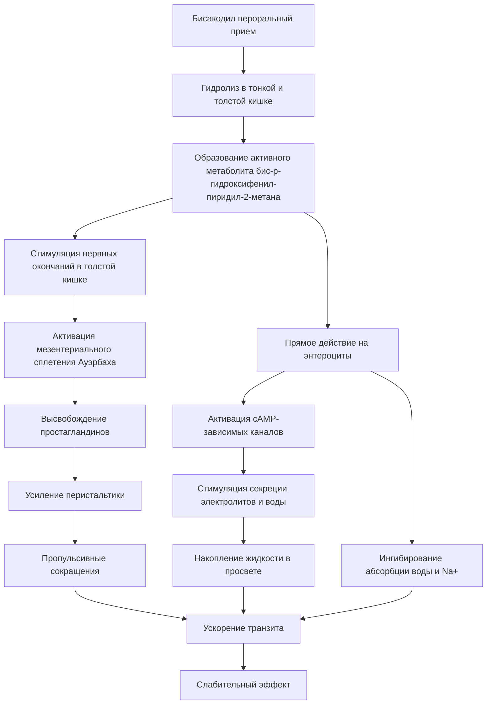

__Показания:__

- Острый запор
- Подготовка к диагностическим процедурам
- Постоперационный запор (после операции Гиршпрунга по рекомендациям NASPGHAN 2023)
- Запор, индуцированный опиоидами
- Опорожнение кишечника перед родами

__Противопоказания:__

- Кишечная непроходимость
- Острый живот
- Воспалительные заболевания кишечника в стадии обострения
- Тяжелая дегидратация
- Дети <2 лет (суппозитории)

__Дозировка:__

- Таблетки: 5-15 мг на ночь (эффект через 6-12 часов)
- Суппозитории: 10 мг ректально (эффект через 15-60 минут)

__Фармакокинетика:__

- Минимальное всасывание (<5%)
- Действует локально
- Начало: 6-12 часов (per os), 15-60 минут (ректально)

__Побочные эффекты:__

__Частые:__

- Абдоминальные спазмы (30-50%)
- Дискомфорт в животе
- Диарея (при передозировке)

__При хроническом использовании/передозировке:__

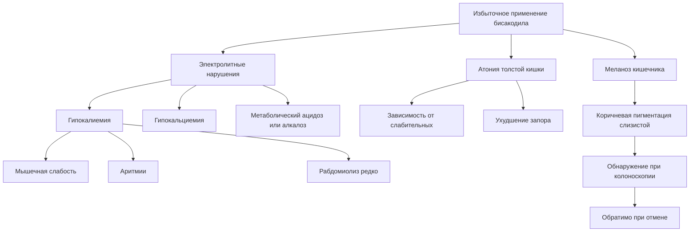

__Лекарственные взаимодействия:__

- __Антациды, молоко:__ разрушают энтеросолюбильное покрытие → преждевременная активация → спазмы
- __Диуретики (фуросемид, гидрохлоротиазид):__ усиление гипокалиемии
- __Дигоксин:__ гипокалиемия → повышенный риск токсичности дигоксина
- __Кортикостероиды:__ усиление гипокалиемии

__Злоупотребление:__

- Частое при расстройствах пищевого поведения (анорексия, булимия)
- Может привести к:
  - Гипокалиемии тяжелой
  - Рабдомиолизу
  - "Синдрому ленивого кишечника"
  - Психологической зависимости

---

# Противодиарейные препараты

## Лоперамид

__Механизм действия:__

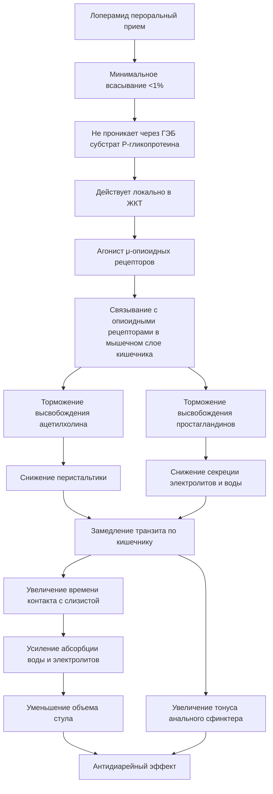

__Показания:__

- Острая неспецифическая диарея
- Диарея путешественников
- Хроническая диарея при ВЗК (вспомогательно)
- Синдром раздраженного кишечника с диареей
- Снижение объема отделяемого при илеостомах

__Противопоказания:__

- Дети <2 лет (риск угнетения дыхания и нарушений ритма сердца)
- Острая дизентерия (кровь в стуле + лихорадка)
- Псевдомембранозный колит (C. difficile)
- Бактериальный энтероколит (Salmonella, Shigella, Campylobacter)
- Острый язвенный колит
- Мегаколон токсический
- Абдоминальная боль без диареи
- Беременность (особенно I триместр)

__Дозировка:__

- Взрослые: начальная 4 мг, затем 2 мг после каждого жидкого стула (максимум 16 мг/день)
- Дети 6-12 лет: 2 мг после каждого жидкого стула (максимум 8 мг/день)
- __КРИТИЧНО:__ не использовать у детей <2 лет

__Фармакокинетика:__

- Биодоступность: очень низкая (<1%) из-за эффекта первого прохождения и P-гликопротеина
- Период полувыведения: 10.8 часов (9.1-14.4)
- Метаболизм: N-деметилирование (CYP3A4, CYP2C8)
- Экскреция: в основном с фекалиями
- __P-гликопротеин:__ активно выводит лоперамид из ЦНС → минимальные центральные опиоидные эффекты

__Побочные эффекты:__

__Частые (1-10%):__

- Запор
- Спазмы в животе
- Тошнота
- Головокружение
- Сонливость

__Редкие (<1%):__

- Сыпь
- Задержка мочи
- Сухость во рту

__Серьезные (при передозировке или злоупотреблении):__

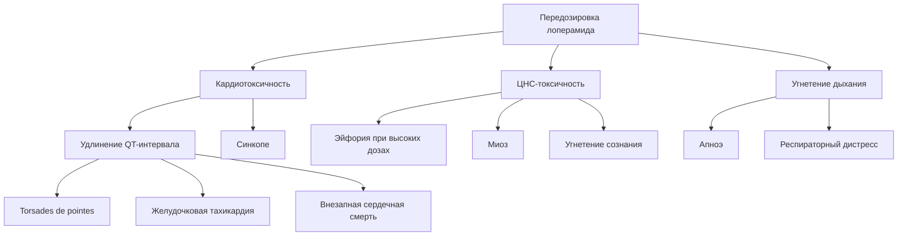

__Злоупотребление лоперамидом:__

- Растущая проблема среди лиц с опиоидной зависимостью
- "Poor man's methadone" - эффект при мегадозах (50-300 мг)
- Механизм: подавление P-гликопротеина → проникновение через ГЭБ → центральные опиоидные эффекты
- Опасность:
  - Кардиотоксичность (даже при отсутствии факторов риска)
  - Желудочковые аритмии
  - Смерть

__Лекарственные взаимодействия:__

__Ингибиторы P-гликопротеина (повышают концентрацию лоперамида, усиливают ЦНС-эффекты):__

- Хинидин (повышение уровня в 2-3 раза)
- Ритонавир (повышение в 2-3 раза)
- Итраконазол
- Верапамил
- Кларитромицин
- Ранолазин
- Амиодарон
- Карведилол

__Ингибиторы CYP3A4:__

- Кетоконазол (90% ингибирование N-деметилирования in vitro)
- Эритромицин
- Грейпфрутовый сок

__Индукторы P-гликопротеина (снижают эффективность):__

- Рифампицин
- Карбамазепин
- Фенитоин
- Митотан

__Препараты, удлиняющие QT (аддитивный риск аритмий):__

- Амиодарон
- Метадон
- Моксифлоксацин
- Галоперидол
- Хлорпромазин
- Соталол

__Осложнения при неправильном применении:__

- Токсический мегаколон (при инфекционной диарее)
- Маскирование симптомов серьезных заболеваний
- Замедление элиминации токсинов при инфекционной диарее

---

# Противорвотные средства (антиэметики)

## Классификация по механизму действия

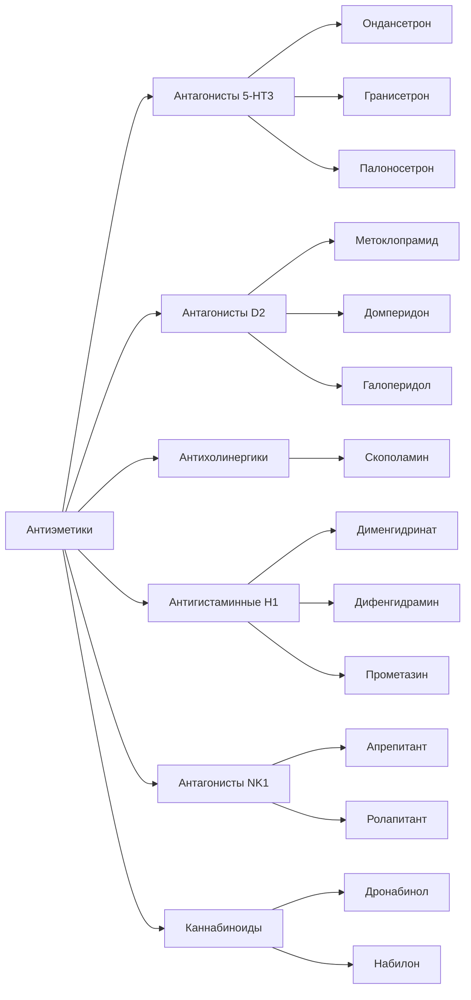

## 1. Антагонисты 5-HT₃ рецепторов

### Ондансетрон

__Механизм действия:__

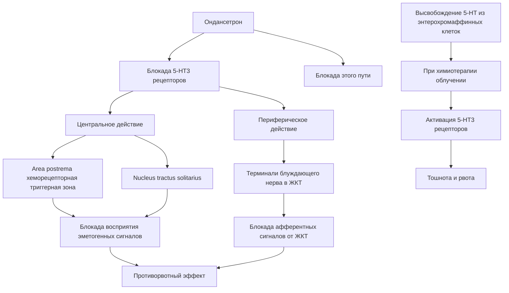

__Показания (FDA-одобренные):__

- Профилактика тошноты/рвоты, индуцированных химиотерапией (CINV)
- Профилактика радиационно-индуцированной тошноты/рвоты
- Профилактика послеоперационной тошноты/рвоты (PONV)

__Показания (off-label):__

- Острый гастроэнтерит у детей (с дегидратацией, в условиях ER)
- Гиперемезис беременных (тошнота/рвота при беременности)
- Циклический рвотный синдром у детей
- Диарея при нейроэндокринных опухолях (рефрактерная)

__Противопоказания:__

- Гиперчувствительность к ондансетрону или другим 5-HT₃ антагонистам
- Врожденный синдром удлиненного QT
- Одновременный прием с апоморфином

__Дозировка:__

- CINV (высокоэметогенная химиотерапия): 24 мг перорально за 30 мин до химиотерапии
- PONV: 4 мг в/в однократно перед индукцией анестезии
- Гастроэнтерит у детей (off-label):
  - 8-15 кг: 2 мг перорально
  - 15-30 кг: 4 мг
  - > 30 кг: 8 мг

__Фармакокинетика:__

- Биодоступность: 60% (пероральная форма)
- Период полувыведения: 3-6 часов
- Метаболизм: CYP3A4, CYP2D6, CYP1A2
- Экскреция: моча (44-60%), кал (25%)

__Побочные эффекты:__

__Частые (>1%):__

- Головная боль (10-27%) - наиболее частый
- Запор (6-11%)
- Головокружение (4-7%)
- Диарея (2-4%)
- Общее недомогание

__Менее частые:__

- Сонливость
- Зуд
- Повышение трансаминаз (транзиторное)

__Серьезные побочные эффекты:__

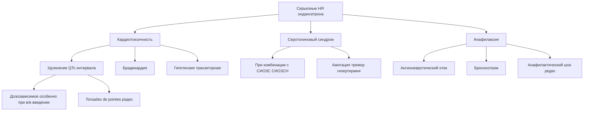

__FDA предупреждение (2012):__

- Избегать в/в доз >16 мг из-за риска удлинения QT
- Мониторинг ЭКГ у пациентов с:
  - Врожденным синдромом удлиненного QT
  - Электролитными нарушениями (гипокалиемия, гипомагниемия)
  - Застойной сердечной недостаточностью
  - Брадиаритмиями
  - Приемом препаратов, удлиняющих QT

__Лекарственные взаимодействия:__

__Препараты, удлиняющие QT (аддитивный риск):__

- Антиаритмики класса IA, III
- Антипсихотики (галоперидол, зипразидон)
- Антидепрессанты (циталопрам, эсциталопрам)
- Фторхинолоны (моксифлоксацин)
- Макролиды (азитромицин, кларитромицин)

__Индукторы CYP3A4 (снижение эффективности):__

- Рифампицин
- Карбамазепин
- Фенитоин

__Серотонинергические препараты (риск серотонинового синдрома):__

- СИОЗС, СИОЗСН
- Трициклические антидепрессанты
- Трамадол
- Фентанил

__Апоморфин:__

- __ПРОТИВОПОКАЗАНА__ комбинация (глубокая гипотензия, потеря сознания)

__Беременность:__

- Категория B (FDA)
- Исследования показывают безопасность при использовании в I триместре
- Нет повышенного риска врожденных аномалий
- Можно использовать при гиперемезисе беременных

---

## 2. Антагонисты дофаминовых D₂ рецепторов

### Метоклопрамид

__Механизм действия:__

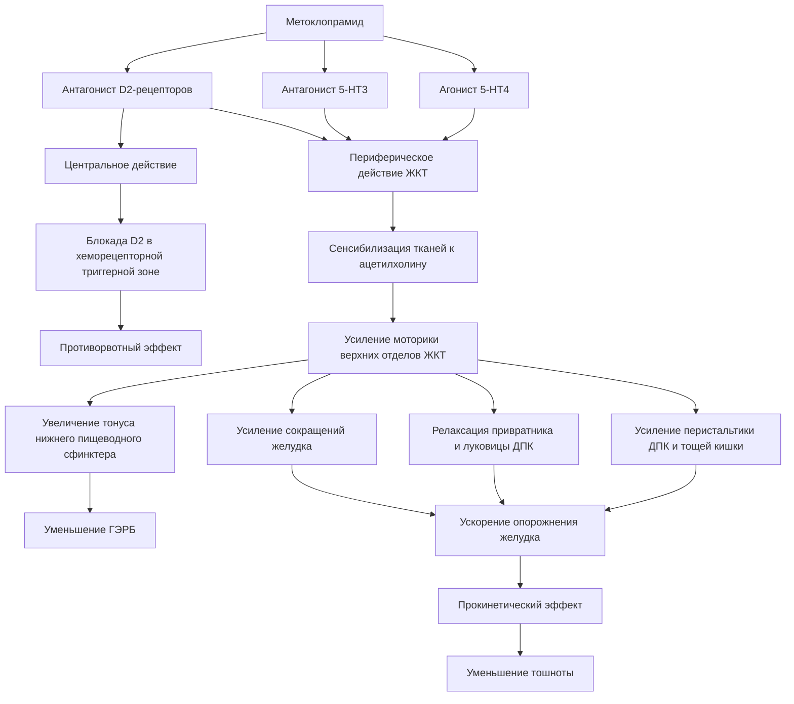

__Показания (FDA-одобренные):__

- Симптоматическое лечение ГЭРБ (краткосрочно, 4-12 недель)
- Диабетический гастропарез
- Профилактика тошноты/рвоты при химиотерапии
- Профилактика послеоперационной тошноты/рвоты (когда назогастральная аспирация недоступна)

__Показания (off-label):__

- Мигрень (улучшение абсорбции пероральных анальгетиков)
- Тошнота/рвота при беременности (второй линии после доксиламин/пиридоксин)
- Усиление лактации (галактагог)

__КРИТИЧЕСКОЕ FDA предупреждение (Black Box, 2009):__

- __Поздняя дискинезия (ПД)__ - потенциально необратимое и обезображивающее расстройство движений
- Риск повышается с длительностью терапии и кумулятивной дозой
- Риск выше у:
  - Пожилых (особенно женщин)
  - Пациентов на длительной терапии (>12 недель)
- __РЕКОМЕНДАЦИЯ:__ избегать терапии >12 недель, кроме редких случаев когда польза превышает риск

__Противопоказания:__

- Гиперчувствительность
- Феохромоцитома (может спровоцировать гипертонический криз)
- Эпилепсия/судорожные расстройства (снижает порог судорожной готовности)
- Кишечная непроходимость, перфорация, кровотечение
- Одновременный прием препаратов, вызывающих экстрапирамидные реакции
- Болезнь Паркинсона (ухудшение симптомов)

__Дозировка:__

- ГЭРБ: 10-15 мг 4 раза/день за 30 мин до еды и на ночь
- Диабетический гастропарез: 10 мг 30 мин до еды и на ночь, до 10 дней
- __Максимальная длительность:__ 12 недель

__Фармакокинетика:__

- Биодоступность: 80% (пероральная)
- Начало действия: 30-60 минут (per os), 1-3 мин (в/в)
- Период полувыведения: 5-6 часов
- Метаболизм: печеночный (CYP2D6)
- Экскреция: почечная (85%)

__Подробные побочные эффекты:__

__Очень частые (>10%):__

- Сонливость (10-70%)
- Усталость (10%)
- Беспокойство, ажитация (10-20%)

__Частые (1-10%):__

- Экстрапирамидные симптомы (ЭПС):
  - Акатизия (беспокойство, невозможность усидеть на месте) - 10-20%
  - Острая дистония (спазмы мышц, кривошея, окулогирные кризы) - 0.2-1%
  - Паркинсонизм (тремор, ригидность, брадикинезия) - 1-5%
- Диарея (5%)
- Головокружение (1-4%)
- Головная боль (4-5%)
- Бессонница (особенно у пожилых)

__Серьезные экстрапирамидные побочные эффекты:__

```mermaid
graph TD
    A[Экстрапирамидные эффекты метоклопрамида] --> B[Острая дистония]
    A --> C[Акатизия]
    A --> D[Паркинсонизм]
    A --> E[Поздняя дискинезия]
    A --> F[Злокачественный нейролептический синдром]
    
    B --> G[Окулогирный криз]
    B --> H[Тортиколлис кривошея]
    B --> I[Опистотонус]
    B --> J[Тризм челюсти]
    B --> K[Девиация языка]
    B --> L[Начало через 24-72 часа после первой дозы]
    B --> M[Лечение дифенгидрамин бензтропин]
    
    C --> N[Двигательное беспокойство]
    C --> O[Невозможность сидеть спокойно]
    C --> P[Тревога ажитация]
    
    D --> Q[Тремор покоя]
    D --> R[Мышечная ригидность]
    D --> S[Брадикинезия]
    D --> T[Обратимо при отмене]
    
    E --> U[Непроизвольные движения]
    E --> V[Гримасы лица]
    E --> W[Причмокивание губами]
    E --> X[Высовывание языка]
    E --> Y[Хореоатетоз]
    E --> Z[ЧАСТО НЕОБРАТИМО]
    E --> AA[Риск повышается с длительностью терапии]
    
    F --> AB[Редко <0.1%]
    F --> AC[Гипертермия]
    F --> AD[Мышечная ригидность]
    F --> AE[Автономная дисфункция]
    F --> AF[Изменение сознания]
    F --> AG[Повышение КФК]
    F --> AH[НЕОТЛОЖНОЕ СОСТОЯНИЕ]
    F --> AI[Лечение дантролен немедленная отмена]
```

__Другие серьезные побочные эффекты:__

- __Гиперпролактинемия:__
  - Галакторея
  - Гинекомастия
  - Аменорея
  - Снижение либидо
  - Импотенция
- __Психиатрические:__
  - Депрессия (2-5%)
  - Суицидальные мысли (редко, у пациентов с депрессией в анамнезе)
  - Спутанность сознания
  - Галлюцинации
- __Метгемоглобинемия:__
  - У пациентов с дефицитом G6PD
  - У новорожденных при передозировке
  - Цианоз, одышка
- __Повышение альдостерона:__
  - Задержка жидкости
  - Объемная перегрузка

__Лекарственные взаимодействия:__

__Препараты, усиливающие ЭПС (не комбинировать):__

- Антипсихотики (галоперидол, рисперидон, оланзапин)
- Другие антиэметики (прохлорперазин, прометазин)

__МАО-ингибиторы:__

- __ПРОТИВОПОКАЗАНА__ комбинация (риск серьезных побочных эффектов из-за избыточного высвобождения нейромедиаторов)

__Влияние на абсорбцию других препаратов:__

- __Ускоряет опорожнение желудка:__
  - Ускорение абсорбции: алкоголь, диазепам, циклоспорин
  - Замедление абсорбции: дигоксин (↓ уровень в крови), циметидин

__Холинолитики:__

- Ослабляют прокинетический эффект метоклопрамида

__Особые популяции:__

__KIDS list (Key Potentially Inappropriate Drugs in Pediatrics):__

- Метоклопрамид включен из-за высокого риска побочных реакций у детей
- Требует тщательного мониторинга ЭПС

__Beers Criteria (пожилые пациенты):__

- Потенциально нежелательный препарат для лиц >65 лет
- Повышенный риск ЭПС и поздней дискинезии
- Мониторинг на экстрапирамидные симптомы и ПД обязателен

__Беременность:__

- Категория B (FDA)
- Использовать только при явной необходимости
- Предпочтительны доксиламин + пиридоксин

---

# Препараты, стимулирующие аппетит

## Ципрогептадин

__Механизм действия:__

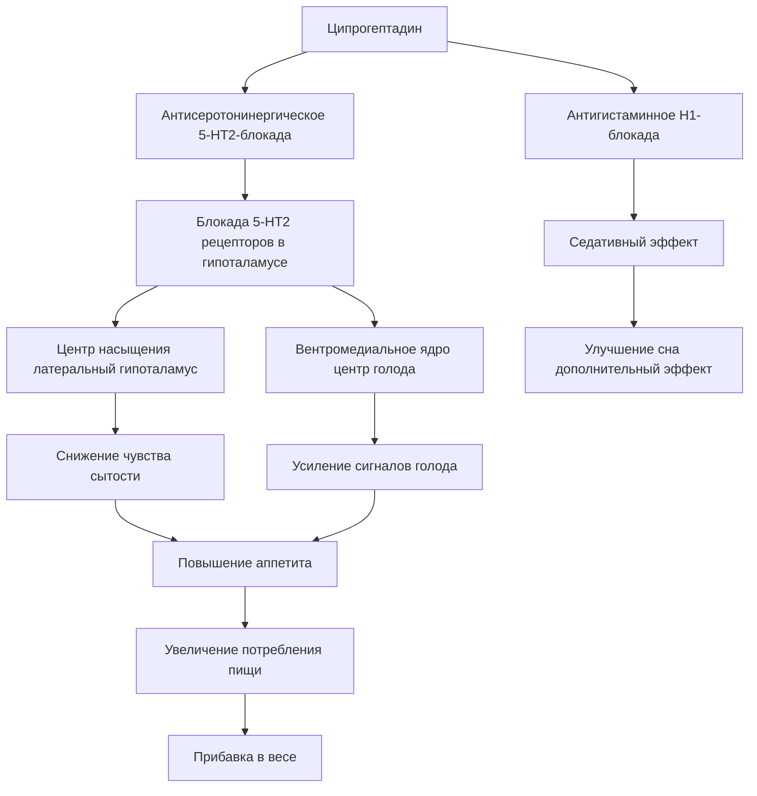

__Показания (FDA-одобренные):__

- Аллергический ринит
- Крапивница

__Показания (off-label, широко используются):__

- __Стимуляция аппетита:__
  - Недостаточность питания у детей
  - Задержка роста (failure to thrive)
  - Муковисцидоз
  - Анорексия у онкологических больных (ограниченная эффективность)
  - ARFID (avoidant/restrictive food intake disorder)
  - Анорексия, индуцированная стимуляторами (СДВГ)
- __Профилактика мигрени__ (у детей и подростков)
- __Лечение серотонинового синдрома__ (антидот)
- __Циклическая рвота у младенцев__
- __Акатизия__
- __Поздняя дискинезия__

__Противопоказания:__

- Гиперчувствительность к ципрогептадину
- Прием МАО-ингибиторов (в течение 14 дней)
- Узкоугольная глаукома
- Обструкция шейки мочевого пузыря
- Пептическая язва со стенозом
- Новорожденные и недоношенные дети
- Период лактации

__Дозировка (стимуляция аппетита, off-label):__

- Дети 2-6 лет: 2 мг 2-3 раза/день
- Дети 7-14 лет: 4 мг 2-3 раза/день
- Взрослые: 4 мг 3 раза/день (максимум 32 мг/день)
- Эффект обычно наступает через 1-2 недели

__Фармакокинетика:__

- Хорошо всасывается перорально
- Пик концентрации: 2 часа
- Период полувыведения: 16 часов (широкая вариабельность)
- Метаболизм: печеночный
- Экскреция: моча (40%), фекалии

__Эффективность (систематический обзор 2019, 46 исследований):__

- 39 из 46 исследований показали значимую прибавку в весе
- Эффективен в разных популяциях (дети с недостаточностью питания, муковисцидоз, расстройства пищевого поведения)
- __НИЗКАЯ эффективность__ при:
  - ВИЧ-ассоциированной кахексии
  - Онкологической кахексии
  - Прогрессирующих заболеваниях

__Механизм прибавки веса:__

- Прямая стимуляция аппетита (антисеротонинергический эффект)
- Возможное влияние на уровень инсулиноподобного фактора роста-1 (IGF-1)
- Седация → улучшение сна → анаболический эффект

__Побочные эффекты:__

__Очень частые (>10%):__

- __Сонливость (50-70%)__ - наиболее частый и дозозависимый
  - Транзиторная (обычно уменьшается через 1-2 недели)
  - Может влиять на школьную успеваемость у детей

__Частые (1-10%):__

- Головокружение
- Сухость во рту
- Тошнота
- Усталость
- Раздражительность (у детей)
- Головная боль

__Менее частые (<1%):__

- Спутанность сознания
- Беспокойство
- Тремор
- Задержка мочи
- Запор
- Нечеткость зрения

__Серьезные побочные эффекты:__

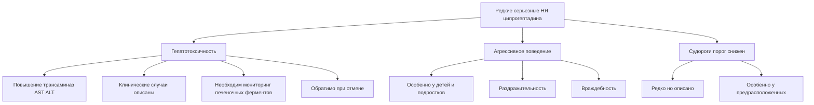

__Особые предупреждения:__

- __Антихолинергические эффекты:__
  - Задержка мочи
  - Сухость во рту
  - Запор
  - Мидриаз (расширение зрачков)
- __ЦНС:__
  - Может снизить умственную и физическую активность
  - Не управлять транспортом при начале терапии

__Лекарственные взаимодействия:__

__ЦНС-депрессанты (аддитивная седация):__

- Бензодиазепины
- Опиоиды
- Барбитураты
- Алкоголь
- Другие антигистаминные

__МАО-ингибиторы:__

- __ПРОТИВОПОКАЗАНА__ комбинация
- Может пролонгировать и усиливать антихолинергические эффекты

__Серотонинергические препараты:__

- СИОЗС (флуоксетин, сертралин)
- Может снижать их эффективность (антисеротонинергическое действие ципрогептадина)
- Парадоксально используется для лечения серотонинового синдрома

__Клинический мониторинг:__

- Базовые печеночные пробы перед началом
- Оценка печеночных ферментов при длительной терапии (>6 месяцев)
- Оценка роста и веса каждые 2-4 недели
- Оценка побочных эффектов (сонливость, поведение)

__Беременность и лактация:__

- Категория B (FDA)
- Безопасность недостаточно изучена
- Противопоказан при грудном вскармливании (может подавлять лактацию, проникает в грудное молоко)

---

## Дронабинол (синтетический ТГК)

__Механизм:__

- Агонист каннабиноидных рецепторов CB₁ (ЦНС) и CB₂ (периферия)
- Стимулирует центр голода в гипоталамусе
- Повышает уровень грелина
- Улучшает вкусовые ощущения

__Показания (FDA):__

- Анорексия при СПИДе с потерей веса
- Тошнота/рвота при химиотерапии (рефрактерные)

__Дозировка:__

- Начало: 2.5 мг 2 раза/день (перед обедом и ужином)
- Максимум: 20 мг/день

__Побочные эффекты:__

- Психоактивные эффекты (эйфория, дисфория, паранойя, беспокойство)
- Сонливость
- Головокружение
- Тахикардия
- Ортостатическая гипотензия
- Сухость во рту

---

# Препараты, подавляющие аппетит

## Агонисты GLP-1 рецепторов

### Общий механизм действия

```mermaid
flowchart TB
    A[GLP-1 агонист инъекционный] --> B[Связывание с GLP-1 рецепторами]
    
    B --> C[Поджелудочная железа]
    C --> D[β-клетки]
    D --> E[Глюкозозависимая стимуляция секреции инсулина]
    E --> F[Снижение гликемии]
    
    C --> G[α-клетки]
    G --> H[Подавление секреции глюкагона]
    H --> F
    
    B --> I[Желудок]
    I --> J[Замедление опорожнения желудка]
    J --> K[Продленное чувство сытости]
    
    B --> L[ЦНС гипоталамус]
    L --> M[Дугообразное ядро arc]
    M --> N[Активация POMC нейронов проопиомеланокортин]
    N --> O[Подавление аппетита]
    
    M --> P[Ингибирование NPY/AgRP нейронов]
    P --> O
    
    L --> Q[Area postrema]
    Q --> R[Чувство тошноты механизм снижения аппетита]
    
    O --> S[Снижение потребления пищи]
    K --> S
    R --> S
    S --> T[Потеря веса]
```

### Лираглутид (Saxenda для ожирения)

__Показания (FDA):__

- Управление весом при ожирении (ИМТ ≥30) или избыточном весе (ИМТ ≥27) с сопутствующими состояниями
- Сахарный диабет 2 типа (Victoza, в меньшей дозе)

__Дозировка (для снижения веса):__

- Начало: 0.6 мг п/к ежедневно
- Титрование: увеличение на 0.6 мг еженедельно
- Целевая доза: 3.0 мг/день

__Фармакокинетика:__

- Биодоступность: 55% (п/к)
- Период полувыведения: 13 часов
- Связывание с белками: >98%
- Достижение steady state: 3-5 дней

__Эффективность (клинические исследования):__

- Средняя потеря веса: __5-8% от исходного__ за 1 год (плацебо-корректированная)
- SCALE испытания (2015): 63.2% пациентов потеряли ≥5% веса
- Дополнительные преимущества:
  - Снижение HbA1c у диабетиков
  - Снижение артериального давления
  - Улучшение липидного профиля

__Побочные эффекты GLP-1 агонистов:__

```mermaid
graph TD
    A[Побочные эффекты GLP-1 агонистов] --> B[Желудочно-кишечные наиболее частые]
    A --> C[Панкреобилиарные]
    A --> D[Эндокринные]
    A --> E[Сердечно-сосудистые]
    A --> F[Другие]
    
    B --> G[Тошнота 40-50%]
    B --> H[Рвота 15-20%]
    B --> I[Диарея 20-25%]
    B --> J[Запор 20-25%]
    B --> K[Диспепсия]
    B --> L[Абдоминальная боль]
    B --> M[Метеоризм]
    
    G --> N[Транзиторная пик в первые 4-8 недель]
    N --> O[Уменьшается со временем]
    
    C --> P[Острый панкреатит <0.1%]
    C --> Q[Холелитиаз желчные камни]
    C --> R[Холецистит]
    
    D --> S[Гипогликемия особенно с инсулином сульфонилмочевиной]
    D --> T[Повышение кальцитонина редко]
    
    E --> U[Тахикардия умеренная]
    E --> V[Повышение ЧСС на 2-10 уд/мин]
    
    F --> W[Реакции в месте инъекции]
    F --> X[Усталость]
    F --> Y[Головная боль]
    F --> Z[Головокружение]
```

__Подробно: желудочно-кишечные побочные эффекты__

- __Тошнота:__ 40.2% пациентов на лираглутиде (vs 13.8% плацебо)
  - Дозозависимая
  - Наиболее выражена в первые 4 недели
  - 24.7% в неделю 4 → 5.5% в неделю 56
  - Причина отмены у 6.4% пациентов
- __Диарея:__ 20.9%
- __Запор:__ 20.0%
- __Рвота:__ 16.3%

__Новые выявленные риски (2023-2024):__

```mermaid
graph TD
    A[Новые риски GLP-1 агонистов] --> B[Аспирация при анестезии]
    A --> C[Сложности подготовки к колоноскопии]
    A --> D[Возможная ассоциация с суицидальными мыслями]
    
    B --> E[Замедленное опорожнение желудка]
    E --> F[Остаточная пища в желудке]
    F --> G[Риск аспирации]
    G --> H[Рекомендация отмена за 1 неделю до плановой операции]
    
    C --> I[Неполная очистка кишечника]
    I --> J[Снижение качества визуализации]
    
    D --> K[EMA расследование июль 2023]
    D --> L[WHO VigiBase семаглутид ROR 1.45]
    D --> M[Данные FAERS повышенная частота]
    D --> N[Особенно при комбинации с антидепрессантами ROR 4.45]
    D --> O[Клиническая значимость спорна]
```

__Серьезные побочные эффекты (редкие):__

__Острый панкреатит (<0.1%):__

- Симптомы: сильная абдоминальная боль, тошнота, рвота
- Требует немедленной отмены GLP-1 агониста
- Диагностика: повышение амилазы/липазы, КТ
- __Важно:__ исследования показывают противоречивые данные о причинно-следственной связи

__Желчнокаменная болезнь:__

- Повышенный риск при быстрой потере веса
- Холецистит, холелитиаз
- Может требовать холецистэктомии

__Медуллярная карцинома щитовидной железы (MTC):__

- __ПРОТИВОПОКАЗАНИЕ:__ личный или семейный анамнез MTC
- __ПРОТИВОПОКАЗАНИЕ:__ множественная эндокринная неоплазия 2 типа (MEN 2)
- Основано на данных грызунов (C-клеточные опухоли)
- У людей связь НЕ подтверждена, но предупреждение сохраняется

__Ретинопатия диабетическая:__

- Возможное прогрессирование при быстром снижении глюкозы
- Мониторинг у пациентов с пролиферативной ретинопатией

__Почечная недостаточность:__

- Редко, связано с тяжелой дегидратацией из-за ЖКТ побочных эффектов
- Острое повреждение почек
- Мониторинг функции почек при диарее/рвоте

__Гипогликемия:__

- Риск повышен при комбинации с:
  - Инсулином
  - Производными сульфонилмочевины
- Требует коррекции доз сопутствующих антидиабетических препаратов

### Семаглутид (Wegovy для ожирения, Ozempic для СД2)

__Дозировка (для снижения веса, Wegovy):__

- Начало: 0.25 мг п/к еженедельно
- Титрование: 0.25 → 0.5 → 1.0 → 1.7 → 2.4 мг каждые 4 недели
- Целевая доза: 2.4 мг еженедельно

__Эффективность:__

- Средняя потеря веса: __12-15%__ от исходного за 68 недель (плацебо-корректированная)
- STEP исследования:
  - STEP 1: 14.9% потери веса vs 2.4% плацебо
  - 86.4% потеряли ≥5% веса
  - 69.1% потеряли ≥10% веса

__Побочные эффекты:__ аналогичны лираглутиду, но:

- Частота ЖКТ побочных эффектов сопоставима
- Инъекции 1 раз в неделю (vs ежедневно у лираглутида) → лучшая приверженность

__Период полувыведения:__ ~7 дней (позволяет еженедельное введение)

### Тирзепатид (Mounjaro для СД2, Zepbound для ожирения) - двойной агонист GLP-1/GIP

__Механизм:__

- Агонист GLP-1 рецепторов (как выше)
- Агонист GIP (glucose-dependent insulinotropic polypeptide) рецепторов
- Синергический эффект на снижение веса

__Дозировка (для снижения веса):__

- Начало: 2.5 мг п/к еженедельно
- Титрование: 2.5 → 5 → 7.5 → 10 → 12.5 → 15 мг каждые 4 недели
- Максимум: 15 мг еженедельно

__Эффективность:__

- Средняя потеря веса: __15-22%__ от исходного (плацебо-корректированная ~18%)
- SURMOUNT исследования:
  - SURMOUNT-1: до 20.9% потери веса на дозе 15 мг

__Побочные эффекты:__

- Аналогичны другим GLP-1 агонистам
- Тошнота, диарея, запор, рвота
- Частота дропаута ниже, чем у некоторых препаратов

### Общие лекарственные взаимодействия GLP-1 агонистов

__Замедление опорожнения желудка → влияние на абсорбцию:__

- __Пероральные препараты с узким терапевтическим индексом:__
  - Варфарин → мониторинг INR
  - Дигоксин → возможно снижение уровня
  - Левотироксин → может потребоваться коррекция дозы

__Антидиабетические препараты:__

- __Инсулин:__ риск гипогликемии → снижение дозы инсулина на 10-20%
- __Производные сульфонилмочевины:__ риск гипогликемии → снижение дозы

__Контрацептивы пероральные:__

- Теоретически может снизиться абсорбция
- Рассмотреть барьерные методы на фоне ЖКТ побочных эффектов

### Противопоказания к GLP-1 агонистам

__Абсолютные:__

- Личный или семейный анамнез медуллярной карциномы щитовидной железы
- Множественная эндокринная неоплазия 2 типа (MEN 2)
- Гиперчувствительность
- Беременность (категория C, тератогенность не исключена)

__Относительные (осторожность):__

- Панкреатит в анамнезе
- Желчнокаменная болезнь
- Диабетическая ретинопатия (особенно пролиферативная)
- Почечная недостаточность тяжелая
- Суицидальные мысли/депрессия в анамнезе (спорно, требует мониторинга)

### Особые популяции

__Беременность:__

- Категория C (FDA)
- Исследования на животных показали неблагоприятные эффекты
- __Отменить минимум за 2 месяца до планируемой беременности__ (семаглутид)
- Не использовать во время беременности

__Грудное вскармливание:__

- Неизвестно, проникает ли в грудное молоко
- Использовать с осторожностью

__Педиатрия:__

- Лираглутид: одобрен для детей ≥12 лет с ожирением
- Семаглутид: одобрен для детей ≥12 лет с ожирением (2022)

__Пожилые:__

- Коррекция дозы не требуется
- Осторожность из-за повышенного риска дегидратации

---

# Сравнительная таблица основных классов препаратов

| Класс | Механизм | Начало действия | Длительность | Основные НЯ | Особенности |
|-------|----------|-----------------|--------------|-------------|-------------|
| __ИПП__ | Необратимое ингибирование H+/K+-АТФазы | 2-3 дня (макс. эффект) | 24-48 ч | Головная боль, диарея; длительно: ↓Mg, ↓B12, риск переломов | Наиболее мощные, принимать за 30-60 мин до еды |
| __H2-блокаторы__ | Конкурентная блокада H2-рецепторов | 30-60 мин | 6-12 ч | Редкие; циметидин: ↔CYP450, гинекомастия | Тахифилаксия, ночная кислотность |
| __Панкрелипаза__ | Ферментное замещение (липаза, протеазы, амилаза) | Локально в ДПК | Время транзита | Абдоминальная боль, диарея; редко: фиброзирующая колонопатия | Дозировать по липазе, не превышать 2500 ЕД/кг/прием у детей |
| __Лактулоза__ | Осмотическое + ацидификация толстой кишки | 24-48 ч | - | Метеоризм (50-70%), спазмы | Для печеночной энцефалопатии + запор |
| __Бисакодил__ | Стимуляция перистальтики + секреции | 6-12 ч (per os), 15-60 мин (ректально) | - | Спазмы; хронически: электролиты↓, атония | Не использовать >1 недели, риск зависимости |
| __Лоперамид__ | μ-опиоидный агонист → ↓перистальтика, ↑абсорбция | 1-2 ч | 10-12 ч | Запор, спазмы; передозировка: аритмии, QT↑ | Не при инфекционной диарее, контроль P-гликопротеина |
| __Ондансетрон__ | Антагонист 5-HT3 центр+периферия | 30 мин | 4-8 ч | Головная боль, запор; редко: QT↑, серотониновый синдром | Избегать в/в >16 мг, мониторинг ЭКГ при рисках |
| __Метоклопрамид__ | Антагонист D2 + прокинетик | 30-60 мин | 4-6 ч | ЭПС (10-20%), сонливость; серьезно: поздняя дискинезия | FDA Black Box: ПД риск, не >12 недель |
| __Ципрогептадин__ | Антагонист H1 + 5-HT2 | 1-2 недели (аппетит) | - | Сонливость (50-70%), редко: гепатотоксичность | Для стимуляции аппетита у детей, off-label |
| __Лираглутид__ | Агонист GLP-1 → ↓аппетит, ↓опорожнение желудка | Недели | Хроническое | Тошнота (40%), диарея, запор; редко: панкреатит, желчные камни | Потеря веса 5-8%, ежедневные инъекции |
| __Семаглутид__ | Агонист GLP-1 | Недели | Хроническое | Аналогичны лираглутиду | Потеря веса 12-15%, еженедельные инъекции |

---

# Клинические алгоритмы

## Алгоритм выбора антисекреторной терапии при ГЭРБ

```mermaid
flowchart TD
    A[ГЭРБ диагностирован] --> B{Тяжесть симптомов}
    
    B -->|Легкие эпизодические| C[Изменение образа жизни + антациды PRN]
    
    B -->|Умеренные регулярные| D[H2-блокаторы фамотидин]
    D --> E{Эффективно через 2 недели?}
    E -->|Да| F[Продолжить 4-8 недель]
    E -->|Нет| G[Переход на ИПП]
    
    B -->|Тяжелые ежедневные| G[ИПП омепразол эзомепразол]
    G --> H{Эффективно через 4 недели?}
    H -->|Да| I[Продолжить 8-12 недель]
    I --> J{Эзофагит при эндоскопии?}
    J -->|Нет| K[Попытка постепенной отмены step-down]
    J -->|Да| L[Поддерживающая терапия ИПП]
    
    H -->|Нет| M[Увеличить дозу или сменить ИПП]
    M --> N{Эффективно?}
    N -->|Нет| O[Эндоскопия + рассмотреть хирургию]
    
    K --> P{Рецидив?}
    P -->|Да| L
    P -->|Нет| Q[Терапия по требованию PRN]
```

## Алгоритм лечения запора

```mermaid
flowchart TD
    A[Хронический запор] --> B[Исключить вторичные причины]
    B --> C[Изменение диеты клетчатка вода]
    C --> D{Улучшение через 2-4 недели?}
    D -->|Да| E[Продолжить диету физактивность]
    D -->|Нет| F[Добавить осмотическое слабительное]
    
    F --> G[ПЭГ полиэтиленгликоль 17г/день]
    G --> H{Эффективно через 1-2 недели?}
    H -->|Да| I[Продолжить долгосрочно безопасно]
    H -->|Нет| J[Добавить стимулирующее слабительное]
    
    J --> K[Бисакодил 5-10 мг на ночь]
    K --> L{Эффективно?}
    L -->|Да| M[Использовать краткосрочно <2 недель]
    M --> N[Попытка отмены стимулятора]
    N --> O{Запор возобновился?}
    O -->|Да| P[Рассмотреть прокинетики прукалоприд]
    O -->|Нет| Q[Продолжить ПЭГ + диета]
    
    L -->|Нет| R[Обследование аноректальная манометрия]
    R --> S[Специализированное лечение]
```

---

# Ключевые моменты для запоминания

## ИПП

- Пролекарства, активируются в кислой среде секреторных канальцев
- __Необратимо__ связываются с Cys813 H+/K+-АТФазы
- Принимать за 30-60 минут __ДО__ еды для максимального эффекта
- Длительное применение: риск ↓Mg²⁺, ↓B₁₂, остеопороз, C. difficile
- Омепразол/эзомепразол: значимое ингибирование CYP2C19 (избегать с клопидогрелом)

## H₂-блокаторы

- Конкурентные антагонисты → обратимое действие
- __Тахифилаксия__ при длительном применении
- Циметидин: мощный ингибитор CYP450, антиандроген
- Ранитидин: изъят с рынка (NDMA контаминация)

## Панкреатические ферменты

- Дозировать по __липазе__
- Дети <12 лет: __НЕ превышать 2500 липазных ед/кг/прием__ (риск фиброзирующей колонопатии)
- Энтеросолюбильные формы защищают от кислоты желудка
- ИПП улучшают эффективность (повышают дуоденальный pH)

## Лоперамид

- __НЕ использовать__ при инфекционной диарее (кровь в стуле, лихорадка)
- __Противопоказан__ детям <2 лет
- P-гликопротеин защищает от ЦНС-эффектов (не проникает через ГЭБ при обычных дозах)
- Злоупотребление (мегадозы) → кардиотоксичность, QT↑, аритмии

## Метоклопрамид

- __FDA Black Box:__ Поздняя дискинезия (потенциально необратима)
- __НЕ использовать >12 недель__ (кроме исключительных случаев)
- Экстрапирамидные симптомы: акатизия (10-20%), острая дистония, паркинсонизм
- Beers Criteria: избегать у пожилых
- __Противопоказан__ при феохромоцитоме, эпилепсии, Паркинсона

## Ондансетрон

- Блокада 5-HT₃ центрально (area postrema) + периферически (n. vagus)
- __FDA предупреждение:__ избегать в/в доз >16 мг (риск QT↑)
- Минимальные побочные эффекты по сравнению с метоклопрамидом
- __НЕ комбинировать__ с апоморфином

## GLP-1 агонисты

- Потеря веса: лираглутид ~5-8%, семаглутид ~12-15%, тирзепатид ~15-22%
- Основной побочный эффект: __тошнота__ (40-50%), транзиторная
- __Противопоказаны:__ MTC/MEN 2 в анамнезе, беременность
- Новые риски: аспирация при анестезии (отменить за 1 неделю до операции)
- Редкие серьезные: панкреатит, желчные камни

## Ципрогептадин

- Антагонист 5-HT₂ в гипоталамусе → стимуляция аппетита
- Основной побочный эффект: __сонливость__ (50-70%)
- Эффективен у детей с недостаточностью питания
- НИЗКАЯ эффективность при ВИЧ/онкологической кахексии
- Редко: гепатотоксичность (мониторинг печеночных ферментов)

---

# Список литературы (ключевые источники)

1. __Proton Pump Inhibitors__
   - Pharmacology of Proton Pump Inhibitors. _PMC_, 2010
   - Spechler SJ. Proton Pump Inhibitors: What the Internist Needs to Know. _Med Clin North Am_, 2019
   - Haastrup PF et al. Side Effects of Long-Term Proton Pump Inhibitor Use. _Basic Clin Pharmacol Toxicol_, 2018

2. __H₂ Receptor Antagonists__
   - H2 Blockers. _StatPearls_, 2024
   - Histamine Type-2 Receptor Antagonists. _LiverTox NCBI Bookshelf_, 2018

3. __Pancreatic Enzymes__
   - Pancrelipase Therapy. _StatPearls_, 2024
   - Created Date: 10/25/2024 Pancreatic Enzymes. _Texas Health and Human Services_, 2024

4. __Laxatives__
   - Laxatives. _StatPearls_, 2024
   - Bisacodyl. _StatPearls_, 2024
   - Lactulose. _StatPearls_, 2024

5. __Antidiarrheals__
   - Loperamide. _StatPearls_, 2024
   - Loperamide: a pharmacological review. _PubMed_, 2008

6. __Antiemetics__
   - Ondansetron. _StatPearls_, 2023
   - Metoclopramide. _StatPearls_, 2023
   - Antiemetic Medications. _StatPearls_, 2022

7. __Appetite Stimulants__
   - Harrison ME et al. Use of cyproheptadine to stimulate appetite and body weight gain: A systematic review. _Appetite_, 2019
   - Efficacy and Tolerability of Cyproheptadine in Poor Appetite. _ScienceDirect_, 2021

8. __GLP-1 Agonists__
   - Glucagon-like Receptor-1 agonists for obesity. _PMC_, 2024
   - Exploring the Side Effects of GLP-1 Receptor Agonist. _Diabetes Metab J_, 2025

---

__Конец конспекта__

_Материал составлен на основе актуальных научных публикаций (2023-2026) и клинических рекомендаций FDA, EMA, ВОЗ_
