> [!$] `$=dv.current().file.name`
> `$=dv.current().summary`

# Фармакотерапия Бронхиальной Астмы

__Клинические рекомендации 2024 г.__

---

## Содержание

1. [Определение и эпидемиология](#определение-и-эпидемиология)
2. [Этиология и патогенез](#этиология-и-патогенез)
3. [Классификация](#классификация)
4. [Клинические проявления](#клинические-проявления)
5. [Ступенчатая терапия](#ступенчатая-терапия)
6. [Фармакологические группы препаратов](#фармакологические-группы-препаратов)
7. [Межлекарственные взаимодействия](#межлекарственные-взаимодействия)

---

## Определение и эпидемиология

__Бронхиальная астма (БА)__ — гетерогенное заболевание, характеризующееся:

- Хроническим воспалением дыхательных путей
- Наличием респираторных симптомов (свистящие хрипы, одышка, заложенность в груди, кашель)
- Вариабельной обструкцией дыхательных путей, которая обратима спонтанно или под влиянием лечения

__Эпидемиология:__

- Распространенность: 339 миллионов человек в мире страдают от астмы (ВОЗ)
- В детском возрасте чаще болеют мальчики
- В подростковом и взрослом возрасте — женщины

---

## Этиология и патогенез

### Этиологические факторы

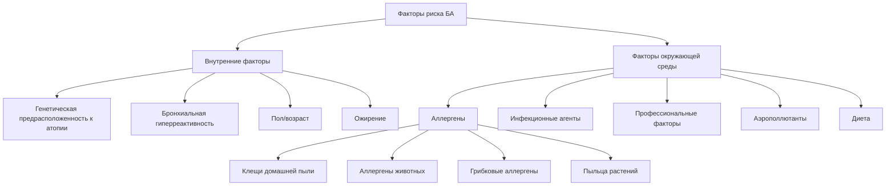

### Патогенез на молекулярном уровне

Патогенез БА представляет собой сложный механизм, включающий:

#### 1. __Аллергический (IgE-опосредованный) путь__

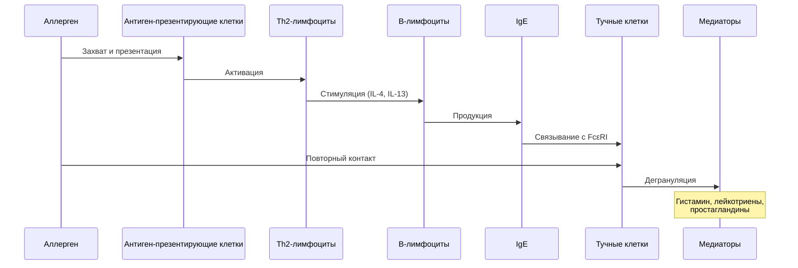

__Ключевые медиаторы воспаления:__

- __Гистамин__ — вазодилатация, бронхоспазм, отёк
- __Лейкотриены (LTC4, LTD4, LTE4)__ — мощные бронхоконстрикторы, гиперсекреция слизи
- __Простагландины (PGD2)__ — бронхоспазм
- __Цитокины (IL-4, IL-5, IL-13)__ — поддержание Th2-ответа, активация эозинофилов

#### 2. __Эозинофильное воспаление__

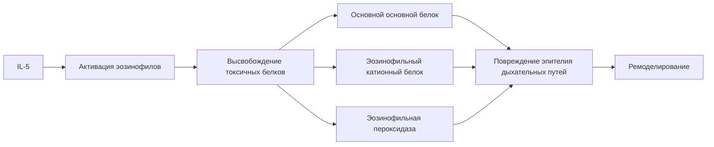

#### 3. __Фазы Астматического ответа__

__Ранняя фаза (0-2 часа после контакта с аллергеном):__

- Дегрануляция тучных клеток
- Выброс преформированных медиаторов
- Бронхоспазм
- Отёк слизистой
- Гиперсекреция слизи

__Поздняя фаза (4-12 часов):__

- Инфильтрация эозинофилами, нейтрофилами, лимфоцитами
- Хроническое воспаление
- Ремоделирование дыхательных путей

#### 4. __Ремоделирование Дыхательных путей__

Хронические структурные изменения:

- Гипертрофия и гиперплазия гладкой мускулатуры бронхов
- Гиперплазия бокаловидных клеток
- Субэпителиальный фиброз
- Утолщение базальной мембраны
- Ангиогенез
- Необратимая обструкция (при длительном течении)

---

## Классификация

### По степени тяжести (до начала лечения)

| Степень тяжести                  | Симптомы                              | Ночные симптомы   | ОФВ1 или ПСВ |
| -------------------------------- | ------------------------------------- | ----------------- | ------------ |
| __Интермиттирующая__             | < 1 раза в неделю                     | ≤ 2 раз в месяц   | ≥ 80%        |
| __Лёгкая персистирующая__        | > 1 раза в неделю, но < 1 раза в день | > 2 раз в месяц   | ≥ 80%        |
| __Среднетяжелая персистирующая__ | Ежедневно                             | > 1 раза в неделю | 60-80%       |
| __Тяжелая персистирующая__       | Постоянно                             | Частые            | < 60%        |

### По уровню контроля (на фоне лечения)

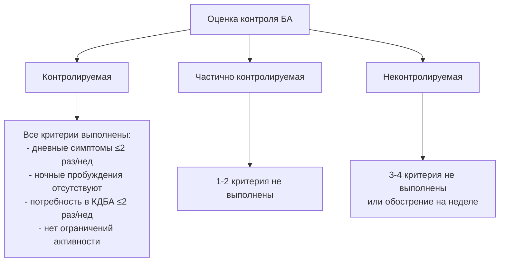

### Фенотипы БА

1. __Аллергическая БА__ — ассоциирована с атопией, повышенным IgE
2. __Неаллергическая БА__ — без признаков аллергии
3. __БА с поздним началом__ — дебют во взрослом возрасте
4. __БА с фиксированной обструкцией__ — необратимое снижение ОФВ1
5. __БА у пациентов с ожирением__

### Эндотипы БА

- __Т2-высокий__ (эозинофильный) — хороший ответ на ИГКС
- __Т2-низкий__ (нейтрофильный, малогранулоцитарный) — часто резистентен к ИГКС

---

## Клинические проявления

### Основные симптомы

1. __Свистящие хрипы (wheezing)__ — высокотональные звуки при дыхании
2. __Одышка__ — затруднённое дыхание, чаще экспираторное
3. __Заложенность в груди__ — чувство сдавления
4. __Кашель__ — часто непродуктивный, ночной и утренний

### Характерные особенности симптомов

- Вариабельность по времени и интенсивности
- Усиление ночью и ранним утром
- Провоцируются триггерами:
  - Физическая нагрузка
  - Аллергены
  - Холодный воздух
  - Вирусные инфекции
  - Эмоции, смех
  - Аэрополлютанты

### Объективные данные

__Физикальное обследование:__

- Участие вспомогательной мускулатуры в дыхании
- Удлинение выдоха
- Сухие свистящие хрипы (при аускультации)
- Коробочный перкуторный звук (при обострении)

__Функциональные показатели:__

- Обратимая обструкция (прирост ОФВ1 > 12% и > 200 мл после бронходилататора)
- Вариабельность ПСВ > 10%
- Положительная проба с метахолином/гистамином

---

## Ступенчатая терапия

### Принципы ступенчатого подхода

__Цели терапии:__

1. Достижение и поддержание контроля над симптомами
2. Минимизация рисков будущих обострений
3. Сохранение нормальной функции лёгких
4. Минимизация побочных эффектов

__Динамика терапии:__

- __Шаг вверх__ — при неконтролируемой БА
- __Шаг вниз__ — при стабильном контроле > 3 месяцев

### Пятиступенчатая терапия для взрослых и подростков ≥12 лет

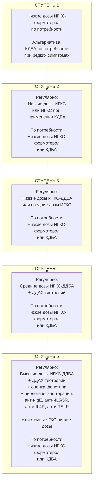

### Дозы ИГКС (мкг/сутки) для взрослых

| Препарат | Низкие дозы | Средние дозы | Высокие дозы |
|----------|-------------|--------------|--------------|
| __Беклометазон__ (ДАИ) | 200-500 | >500-1000 | >1000-2000 |
| __Будесонид__ (ДПИ) | 200-400 | >400-800 | >800-1600 |
| __Флутиказона пропионат__ | 100-250 | >250-500 | >500-1000 |
| __Мометазон__ | 110-220 | >220-440 | >440-880 |
| __Циклесонид__ | 80-160 | >160-320 | >320-1280 |

---

## Фармакологические группы препаратов

### 1. Ингаляционные глюкокортикостероиды (ИГКС)

__Препараты:__

- Беклометазон**
- Будесонид**
- Флутиказона пропионат**
- Флутиказона фуроат
- Мометазона фуроат
- Циклесонид

### Механизм действия на молекулярном уровне

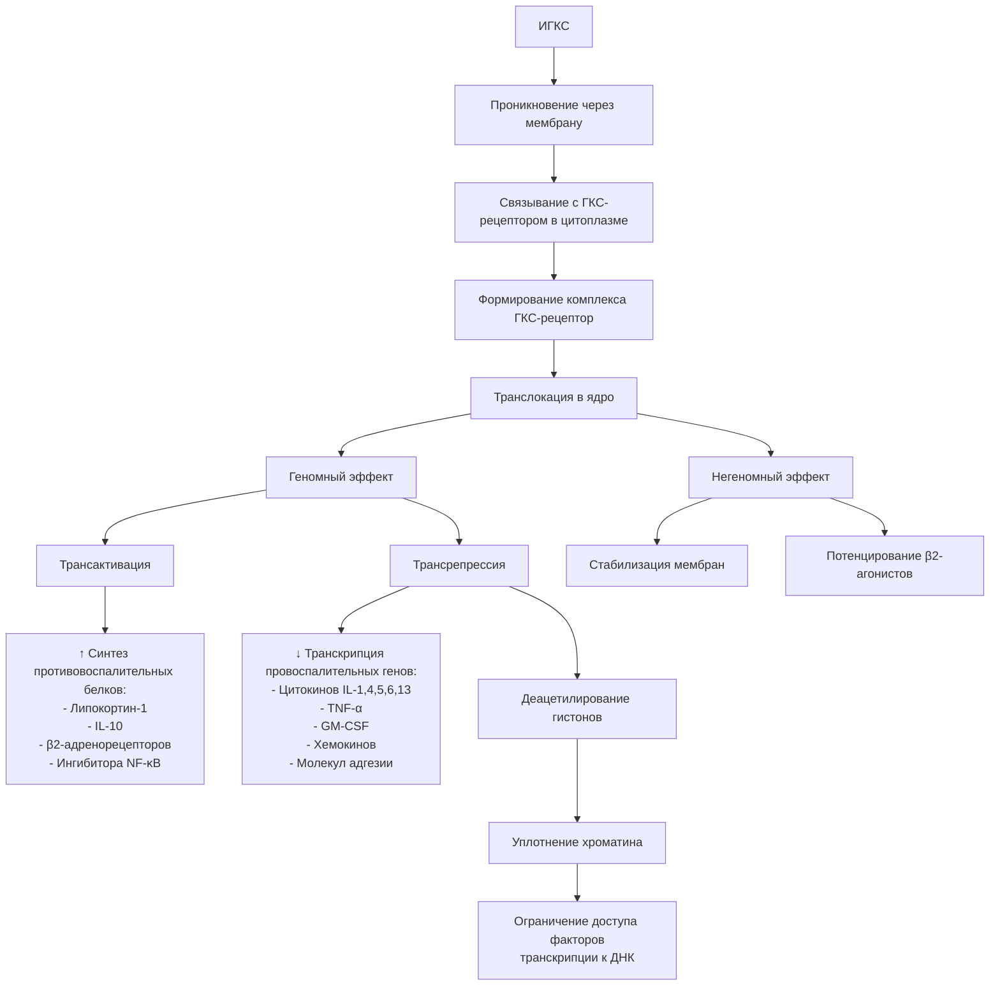

__Противовоспалительные эффекты:__

| Эффект | Механизм |
|--------|----------|
| ↓ Активности эозинофилов | Подавление IL-5, индукция апоптоза |
| ↓ Тучных клеток | Угнетение дегрануляции |
| ↓ Лимфоцитов | Снижение Th2-цитокинов |
| ↓ Макрофагов | Подавление высвобождения медиаторов |
| ↓ Дендритных клеток | Угнетение презентации антигенов |
| ↓ Проницаемости сосудов | Снижение отёка |
| ↓ Секреции слизи | Нормализация функции бокаловидных клеток |
| ↑ β2-рецепторов | Синергизм с бронходилататорами |

### Режимы введения

- __Дозированный аэрозольный ингалятор (ДАИ)__
- __Дозированный порошковый ингалятор (ДПИ)__
- __Небулайзер__ (будесонид)

__Кратность:__ 1-2 раза в сутки в зависимости от препарата

### Побочные эффекты

__Местные:__

- Кандидоз полости рта и глотки (профилактика: полоскание рта)
- Дисфония (осиплость голоса)
- Кашель, раздражение горла

__Системные (при высоких дозах):__

- Угнетение гипоталамо-гипофизарно-надпочечниковой системы
- Остеопороз
- Катаракта, глаукома
- Замедление роста у детей (обратимое)
- Истончение кожи, экхимозы

---

## 2. Длительнодействующие β2-агонисты (ДДБА)

__Препараты:__

- __Формотерол__ — быстрое начало действия (1-3 мин), продолжительность 12 ч
- __Сальметерол__ — медленное начало (10-20 мин), продолжительность 12 ч
- __Вилантерол__ — сверхдлительное действие 24 ч
- __Индакатерол__ — продолжительность 24 ч

Контроль

- калий
- ЭКГ
- тремор

### Механизм действия на молекулярном уровне

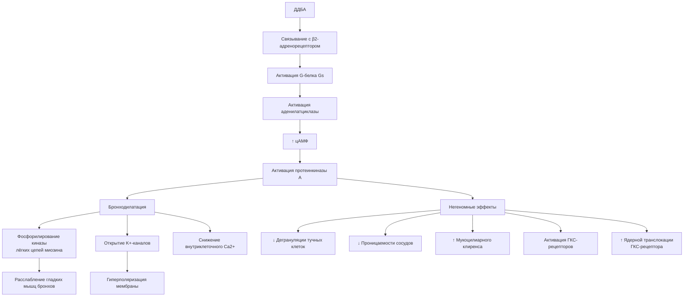

### Синергизм ИГКС и ДДБА

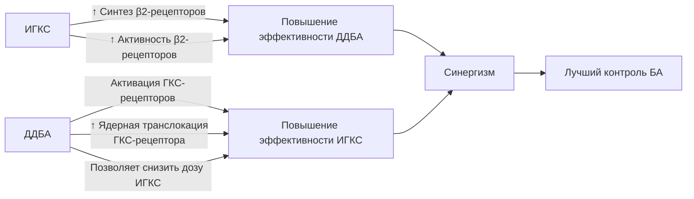

### Режимы введения

__Фиксированные комбинации ИГКС/ДДБА:__

- Будесонид/формотерол (Симбикорт®)
- Флутиказона пропионат/формотерол
- Флутиказона пропионат/сальметерол (Серетид®)
- Флутиказона фуроат/вилантерол
- Мометазон/формотерол (Зенхейл®)

__Кратность:__ 1-2 раза в сутки

__Важно:__ ДДБА НИКОГДА не используются в монотерапии БА!

### Побочные эффекты

- Тремор
- Тахикардия, сердцебиение
- Головная боль
- Гипокалиемия (редко)
- Удлинение интервала QT (редко)
- Парадоксальный бронхоспазм (очень редко)

---

## 3. Короткодействующие β2-агонисты (КДБА)

__Препараты:__

- Сальбутамол**
- Фенотерол**

__Механизм действия:__ аналогичен ДДБА, но с коротким действием (4-6 часов)

__Применение:__ купирование симптомов по потребности

__Важно:__ частое использование (>2 раз в неделю) указывает на неконтролируемую БА

### Побочные эффекты

Аналогичны ДДБА, но менее выражены:

- Тремор
- Тахикардия
- Беспокойство
- Головная боль

---

## 4. Антилейкотриеновые препараты (АЛТР)

__Препараты:__

- Монтелукаст**

### Механизм действия

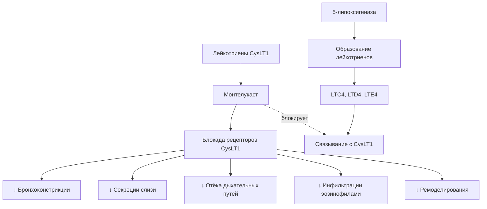

__Лейкотриены (LTC4, LTD4, LTE4):__

- В 1000 раз сильнее гистамина как бронхоконстрикторы
- Увеличивают проницаемость сосудов
- Стимулируют гиперсекрецию слизи
- Привлекают эозинофилы

### Режим применения

- __Доза:__ 10 мг 1 раз в сутки (вечером)
- __Форма:__ таблетки

__Показания:__

- Альтернатива низким дозам ИГКС (ступень 2)
- Дополнение к ИГКС при недостаточном контроле (ступень 3-4)
- БА, индуцированная физической нагрузкой
- Аспириновая БА

### Побочные эффекты

- Головная боль
- Диспепсия
- Повышение трансаминаз (редко)
- Нейропсихические реакции (редко)

---

## 5. Длительнодействующие антихолинергические препараты (ДДАХ)

__Препараты:__

- __Тиотропия бромид__ (Спирива® Респимат®)

### Механизм действия

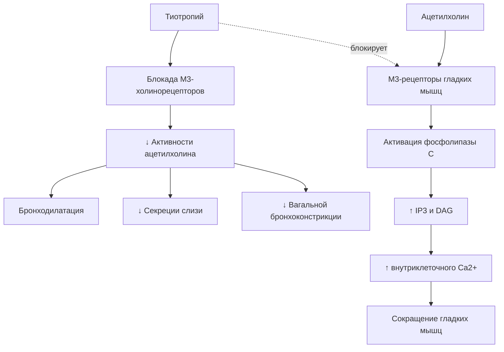

__Особенности:__

- Длительное действие (24 часа)
- Селективность к М3 > М2 рецепторам
- Медленная диссоциация с рецептором (кинетическая селективность)

### Режим применения

- __Доза:__ 5 мкг (2 ингаляции по 2,5 мкг) 1 раз в сутки
- __Устройство:__ Респимат® (мягкий аэрозоль)

__Показания:__

- Дополнение к ИГКС/ДДБА на ступени 4-5

### Побочные эффекты

- Сухость во рту
- Запоры
- Задержка мочи (редко, у пожилых)
- Обострение глаукомы (избегать попадания в глаза)

---

## 6. Биологическая терапия (ступень 5)

Применяется при тяжёлой неконтролируемой БА с определённым фенотипом.

### Анти-IgE терапия

__Препарат:__ Омализумаб**

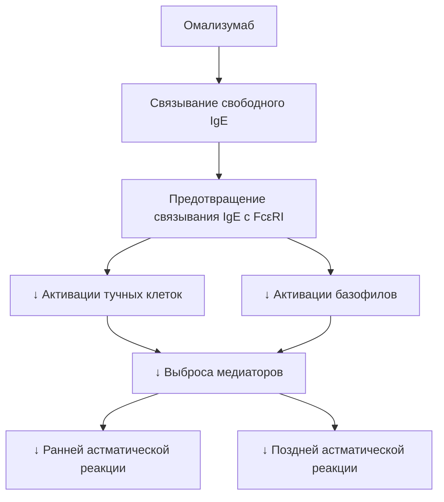

__Показания:__

- Тяжелая аллергическая БА
- IgE 30-1500 МЕ/мл
- Возраст ≥6 лет

__Режим:__ подкожно 1 раз в 2-4 недели (доза зависит от веса и IgE)

### Анти-IL5/IL5R Терапия

__Препараты:__

- Меполизумаб (анти-IL5)**
- Реслизумаб (анти-IL5)
- Бенрализумаб (анти-IL5R)**

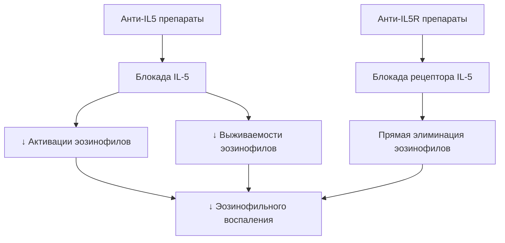

__Показания:__

- Тяжелая эозинофильная БА
- Эозинофилы крови ≥300 клеток/мкл (меполизумаб)
- Эозинофилы крови ≥400 клеток/мкл (реслизумаб)

__Режим:__

- Меполизумаб: 100 мг п/к 1 раз в 4 недели
- Реслизумаб: 3 мг/кг в/в 1 раз в 4 недели
- Бенрализумаб: 30 мг п/к первые 3 дозы каждые 4 недели, затем каждые 8 недель

### Анти-IL4R Терапия

__Препарат:__ Дупилумаб**

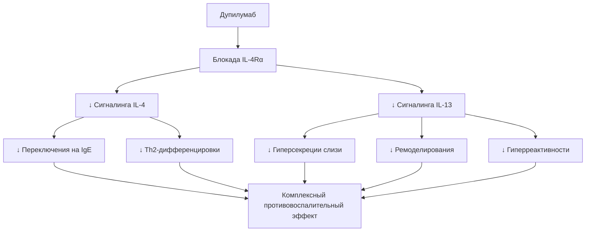

__Показания:__

- Тяжелая БА с Т2-воспалением
- Эозинофилы ≥150 клеток/мкл или FeNO ≥25 ppb

__Режим:__

- Начальная доза: 400-600 мг п/к
- Поддерживающая: 200-300 мг п/к каждые 2 недели

### Анти-TSLP терапия

__Препарат:__ Тезепелумаб

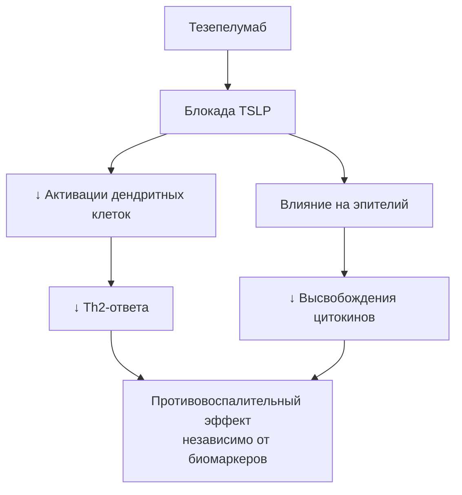

__Показания:__

- Тяжелая БА (может применяться независимо от биомаркеров)

__Режим:__ 210 мг п/к каждые 4 недели

---

## 7. Системные глюкокортикостероиды (ГКС)

__Препараты:__

- Преднизолон**
- Метилпреднизолон**

__Применение:__

- Короткие курсы при обострениях (5-7 дней)
- Низкие дозы длительно при тяжелой БА на ступени 5 (≤7,5 мг/сут преднизолона)

__Механизм:__ аналогичен ИГКС, но системное действие

### Побочные эффекты (при длительном применении)

__Метаболические:__

- Гипергликемия, сахарный диабет
- Остеопороз
- Ожирение, перераспределение жира
- Задержка натрия и воды, гипокалиемия

__Сердечно-сосудистые:__

- Артериальная гипертензия

__Эндокринные:__

- Синдром Кушинга
- Супрессия ГГНС

__Другие:__

- Катаракта, глаукома
- Язвенная болезнь
- Психические расстройства
- Миопатия
- Иммуносупрессия

---

## 8. Теофиллины длительного действия

__Препараты:__

- Теофиллин** (пролонгированные формы)

### Механизм действия

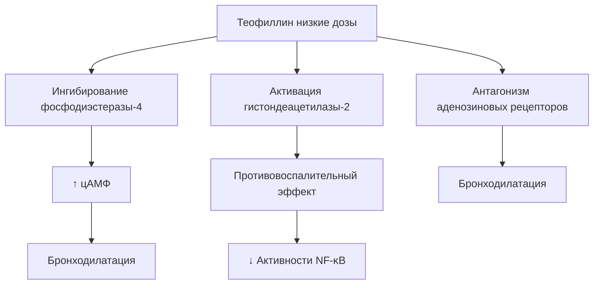

__Применение:__ дополнение к ИГКС на ступени 3-4 (альтернатива ДДБА)

__Режим:__ 200-400 мг 1-2 раза в сутки

__Мониторинг:__ концентрация в крови 5-15 мкг/мл (узкое терапевтическое окно!)

### Побочные эффекты

- Тошнота, рвота, диарея
- Бессонница, тревога
- Тахикардия, аритмии
- Судороги (при передозировке)

---

## Межлекарственные взаимодействия

### 1. ДДБА и КДБА

#### Взаимодействие с антиаритмиками

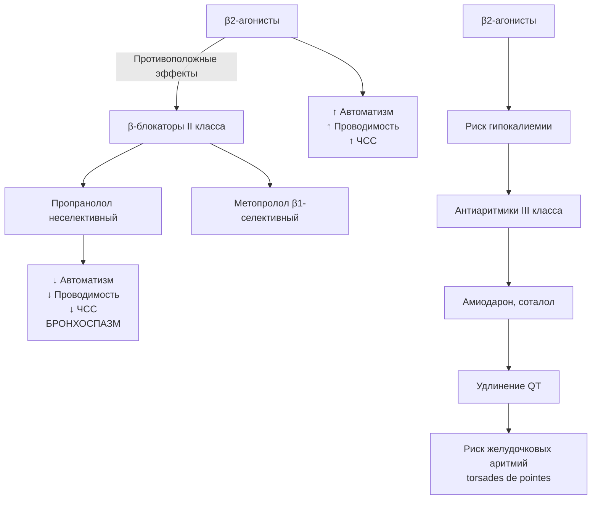

__Клинически значимые взаимодействия:__

| Препарат | Механизм | Клиническое значение | Рекомендации |
|----------|----------|---------------------|--------------|
| __Неселективные β-блокаторы__ (пропранолол, карведилол) | Блокада β2-рецепторов → бронхоспазм | Противопоказаны при БА | Использовать кардиоселективные β-блокаторы (бисопролол, метопролол) с осторожностью |
| __Антиаритмики III класса__ (амиодарон, соталол) | β2-агонисты → гипокалиемия → удлинение QT | Повышенный риск желудочковых аритмий | Мониторинг ЭКГ, калия крови |
| __Антиаритмики IA класса__ (хинидин) | Удлинение QT + гипокалиемия | Риск torsades de points | Контроль электролитов, ЭКГ |

__ВАЖНО:__ При необходимости применения β-блокаторов у пациентов с БА:

- Использовать высокоселективные β1-блокаторы (бисопролол, небиволол)
- Начинать с минимальных доз
- Мониторировать симптомы БА и функцию лёгких

#### Взаимодействие с антибиотиками

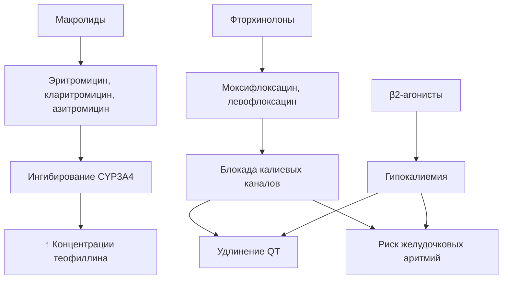

__Клинически значимые взаимодействия:__

| Антибиотик | Механизм | Клиническое значение | Рекомендации |
|------------|----------|---------------------|--------------|
| __Макролиды__ (эритромицин, кларитромицин) | Удлинение QT + гипокалиемия от β-агонистов | Повышенный риск аритмий | Предпочесть азитромицин (меньше влияет на QT), мониторинг ЭКГ |
| __Фторхинолоны__ (моксифлоксацин, левофлоксацин) | Удлинение QT + гипокалиемия | Риск torsades de points | Коррекция электролитов, ЭКГ-контроль |
| __Противогрибковые__ (кетоконазол, итраконазол) | Ингибирование CYP3A4 | ↑ ДДБА (если метаболизируется через CYP3A4) | Осторожность при комбинации |

---

### 2. ИГКС

#### Взаимодействие с антибиотиками

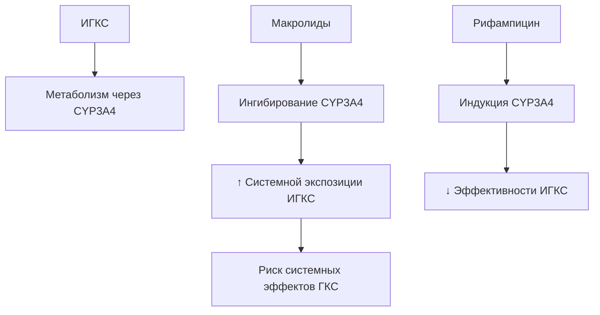

__Клинически значимые взаимодействия:__

| Препарат | Механизм | Клиническое значение | Рекомендации |
|----------|----------|---------------------|--------------|
| __Макролиды__ (кларитромицин, эритромицин) | Ингибирование CYP3A4 | ↑ флутиказона, будесонида → супрессия ГГНС | Короткие курсы, мониторинг побочных эффектов |
| __Азольные противогрибковые__ (кетоконазол, итраконазол) | Сильное ингибирование CYP3A4 | Значительное ↑ ИГКС | Избегать комбинации или снижать дозу ИГКС |
| __Ритонавир__ (ингибитор протеазы ВИЧ) | Мощное ингибирование CYP3A4 | Синдром Кушинга, супрессия ГГНС | Избегать комбинации |
| __Рифампицин__ | Индукция CYP3A4 | ↓ Эффективности ИГКС | Может потребоваться ↑ дозы ИГКС |

---

### 3. Теофиллин

#### Множественные лекарственные взаимодействия

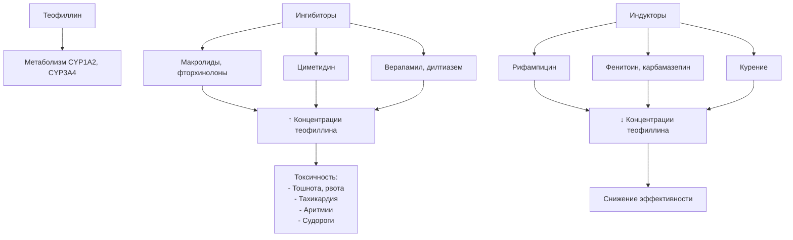

__Клинически значимые взаимодействия:__

| Препарат | Механизм | Эффект | Рекомендации |
|----------|----------|--------|--------------|
| __Ципрофлоксацин__ | Ингибирование CYP1A2 | ↑ теофиллина на 30-40% | ↓ дозы теофиллина на 30%, мониторинг концентрации |
| __Эритромицин, кларитромицин__ | Ингибирование CYP3A4 | ↑ теофиллина на 25-60% | ↓ дозы, контроль концентрации |
| __Циметидин__ | Ингибирование CYP450 | ↑ теофиллина на 40-70% | Заменить на ранитидин или омепразол |
| __Верапамил__ | Ингибирование CYP3A4 | ↑ теофиллина на 20% | Мониторинг концентрации |
| __Рифампицин__ | Индукция CYP1A2 | ↓ теофиллина на 20-40% | Может потребоваться ↑ дозы |
| __Фенитоин, карбамазепин__ | Индукция CYP450 | ↓ теофиллина | Мониторинг эффективности |

__Терапевтическое окно:__ 5-15 мкг/мл (узкое!)

__Токсическая концентрация:__ >20 мкг/мл

---

### 4. Антилейкотриеновые препараты (монтелукаст)

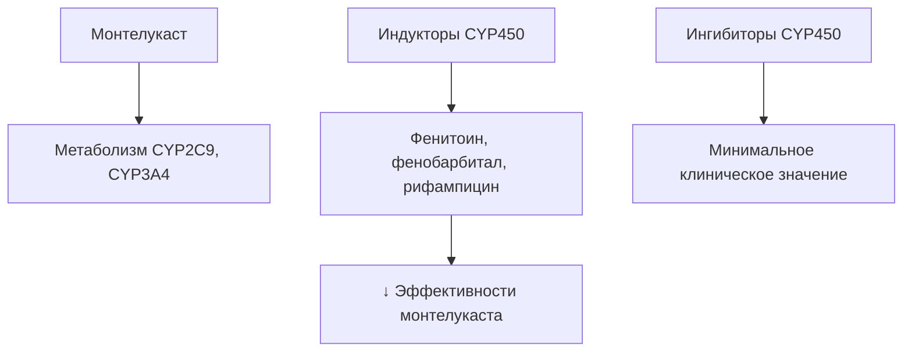

__Монтелукаст имеет мало значимых взаимодействий:__

- Метаболизируется через CYP2C9 и CYP3A4
- Широкий терапевтический диапазон
- Редко требуется коррекция дозы

---

### 5. ДДБА/ИГКС И антигипертензивные препараты

#### Β-блокаторы

```mermaid
graph TD
    A[β2-агонисты] -->|Антагонизм| B[β-блокаторы]
    
    B --> C[Неселективные:<br/>Пропранолол,<br/>Карведилол]
    B --> D[Кардиоселективные:<br/>Метопролол,<br/>Бисопролол,<br/>Небиволол]
    
    C --> E[ПРОТИВОПОКАЗАНЫ<br/>при БА]
    E --> F[Бронхоспазм<br/>Снижение эффекта ДДБА]
    
    D --> G[Применять<br/>с осторожностью]
    G --> H[При ↑ дозы теряют селективность]
```

__Рекомендации:__

- __Противопоказаны:__ неселективные β-блокаторы (пропранолол, карведилол, соталол)
- __С осторожностью:__ кардиоселективные β1-блокаторы (метопролол, бисопролол, небиволол)
  - Начинать с минимальных доз
  - Мониторировать симптомы БА
  - Предпочтительно: небиволол (самый селективный)

#### Ингибиторы АПФ

```mermaid
graph TD
    A[иАПФ] --> B[Побочный эффект:<br/>Сухой кашель<br/>у 10-20% пациентов]
    
    B --> C[Механизм:<br/>↑ Брадикинина<br/>↑ Субстанции P]
    
    C --> D[Может ухудшить<br/>симптомы БА]
    
    E[Альтернатива] --> F[Блокаторы рецепторов<br/>ангиотензина II<br/>сартаны]
    F --> G[Не вызывают кашель]
```

__Клинические рекомендации:__

- иАПФ (эналаприл, лизиноприл, периндоприл) → кашель у 10-20%
- При появлении кашля → перевод на сартаны (лозартан, валсартан, телмисартан)
- Сартаны не влияют на брадикинин → не вызывают кашель

#### Антагонисты кальция

```mermaid
graph TD
    A[Антагонисты кальция] --> B[Дигидропиридины]
    A --> C[Недигидропиридины]
    
    B --> D[Амлодипин,<br/>Нифедипин]
    D --> E[Бронхолитический эффект<br/>безопасны при БА]
    
    C --> F[Верапамил,<br/>Дилтиазем]
    F --> G[Ингибирование CYP3A4]
    G --> H[↑ Теофиллина<br/>↑ ИГКС]
```

__Рекомендации:__

- __Безопасны:__ дигидропиридины (амлодипин, нифедипин) — даже обладают небольшим бронхолитическим эффектом
- __Осторожность:__ верапамил, дилтиазем при комбинации с теофиллином или высокими дозами ИГКС

---

### 6. Диуретики и электролитные нарушения

```mermaid
graph TD
    A[β2-агонисты] --> B[↑ Активность Na+/K+-АТФазы]
    B --> C[Перемещение K+ в клетки]
    C --> D[Гипокалиемия]
    
    E[Петлевые диуретики] --> F[Фуросемид]
    G[Тиазидные диуретики] --> H[Гидрохлоротиазид]
    
    F & H --> D
    
    D --> I[Усиление:<br/>- Аритмогенности<br/>- Удлинения QT<br/>- Мышечной слабости]
    
    J[Системные ГКС] --> D
```

__Рекомендации:__

- Мониторинг калия при комбинации β2-агонистов + диуретики
- Особенно важно при:
  - Высоких дозах β2-агонистов
  - Системных ГКС
  - Заболеваниях сердца
- Профилактика: калийсберегающие диуретики (спиронолактон, амилорид) или препараты калия

---

### 7. Системные глюкокортикостероиды

#### Взаимодействия системных ГКС

```mermaid
graph TD
    A[Системные ГКС] --> B[Множественные взаимодействия]
    
    B --> C[НПВС]
    C --> D[↑ Риск язвенной болезни<br/>желудочно-кишечных кровотечений]
    
    B --> E[Пероральные антикоагулянты<br/>варфарин]
    E --> F[Изменение антикоагулянтного эффекта<br/>требуется ↑ мониторинг МНО]
    
    B --> G[Сахароснижающие препараты]
    G --> H[ГКС → гипергликемия<br/>может потребоваться ↑ доз инсулина]
    
    B --> I[Индукторы CYP3A4<br/>Рифампицин, фенитоин]
    I --> J[↓ Эффективности ГКС]
    
    B --> K[Ингибиторы CYP3A4<br/>Кетоконазол, ритонавир]
    K --> L[↑ Токсичности ГКС]
```

__Клинически значимые взаимодействия:__

| Препарат | Механизм | Клиническое значение | Рекомендации |
|----------|----------|---------------------|--------------|
| __НПВС__ (ибупрофен, диклофенак) | Оба повреждают слизистую ЖКТ | ↑↑ Риск язв, кровотечений | Гастропротекция (ИПП), избегать комбинации |
| __Варфарин__ | ГКС влияют на метаболизм варфарина | Непредсказуемое изменение МНО | Частый контроль МНО |
| __Инсулин, метформин__ | ГКС → инсулинорезистентность | Декомпенсация диабета | Коррекция доз сахароснижающих |
| __Рифампицин__ | Индукция CYP3A4 | ↓ Эффективности ГКС | Может потребоваться ↑ дозы ГКС |
| __Азольные противогрибковые__ | Ингибирование CYP3A4 | ↑ Системной экспозиции ГКС | Снижение доз ГКС |

---

## Сводная таблица межлекарственных взаимодействий

| Препарат БА | Взаимодействующий препарат | Эффект | Механизм | Рекомендации |
|-------------|---------------------------|--------|----------|--------------|
| __ДДБА/КДБА__ | Неселективные β-блокаторы | ↓↓↓ Эффективности, бронхоспазм | Антагонизм β2-рецепторов | __ПРОТИВОПОКАЗАНО__ |
| __ДДБА/КДБА__ | Кардиоселективные β-блокаторы | ↓ Эффективности | Частичный антагонизм | Минимальные дозы, мониторинг |
| __ДДБА/КДБА__ | Антиаритмики III класса | ↑↑ Риск аритмий | Гипокалиемия + удлинение QT | Контроль K+, ЭКГ |
| __ДДБА/КДБА__ | Макролиды, фторхинолоны | ↑ Риск аритмий | Удлинение QT + гипокалиемия | ЭКГ-мониторинг |
| __ДДБА/КДБА__ | Петлевые/тиазидные диуретики | ↑ Гипокалиемия | Совместное выведение K+ | Контроль K+, коррекция |
| __ИГКС__ | Макролиды, азолы | ↑ Системных эффектов | Ингибирование CYP3A4 | Короткие курсы, мониторинг |
| __ИГКС__ | Рифампицин | ↓ Эффективности | Индукция CYP3A4 | Возможно ↑ дозы |
| __Теофиллин__ | Ципрофлоксацин | ↑↑ Токсичность | Ингибирование CYP1A2 | ↓ дозы на 30-50% |
| __Теофиллин__ | Макролиды | ↑ Токсичность | Ингибирование CYP3A4 | Мониторинг концентрации |
| __Теофиллин__ | Циметидин | ↑↑ Токсичность | Ингибирование CYP450 | Заменить на ранитидин |
| __Теофиллин__ | Верапамил, дилтиазем | ↑ Токсичность | Ингибирование CYP3A4 | Мониторинг концентрации |
| __Системные ГКС__ | НПВС | ↑↑ Риск ЖКТ-кровотечений | Совместное повреждение слизистой | Гастропротекция, избегать |
| __Системные ГКС__ | Варфарин | Изменение МНО | Влияние на метаболизм | Частый контроль МНО |
| __Системные ГКС__ | Инсулин | Гипергликемия | Инсулинорезистентность | Коррекция доз инсулина |

---

## Заключение

Фармакотерапия бронхиальной астмы представляет собой сложный многоуровневый подход, основанный на:

1. __Понимании патогенеза__ — воздействие на ключевые звенья воспаления
2. __Ступенчатой терапии__ — индивидуализация лечения в зависимости от тяжести и контроля
3. __Фенотип-ориентированном подходе__ — особенно при тяжёлой БА
4. __Комбинированной терапии__ — синергизм ИГКС и ДДБА
5. __Минимизации рисков__ — учёт межлекарственных взаимодействий

__Ключевые принципы:__

- ИГКС — основа терапии на всех ступенях (кроме 1)
- ДДБА никогда не применяются в монотерапии
- Регулярный мониторинг контроля и коррекция терапии
- Образование пациентов и правильная техника ингаляций
- Избегание триггеров и коррекция сопутствующих заболеваний

__Важность учёта межлекарственных взаимодействий:__

- Особая осторожность при сочетании с кардиологическими препаратами
- Мониторинг электролитов и ЭКГ при риске аритмий
- Коррекция доз при взаимодействии через систему цитохрома P450
- Учёт системных эффектов при высоких дозах ИГКС и системных ГКС

---

## Литература

1. Клинические рекомендации "Бронхиальная астма", 2024 г. (Минздрав России)
2. Global Initiative for Asthma (GINA) 2024
3. Российская ассоциация аллергологов и клинических иммунологов
4. Российское респираторное общество

---

__Дата создания:__ 2026

__Автор:__ Конспект составлен на основе клинических рекомендаций 2024 г. и научных публикаций
